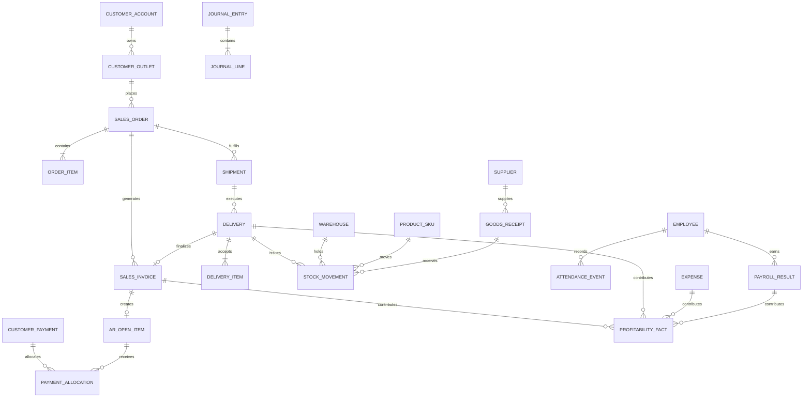

# Enterprise Water Distribution Platform

## Software Requirements Specification (SRS)

| Item | Value |
| --- | --- |
| Document status | Draft for business validation |
| Version | 1.1 |
| Date | 2026-08-11 |
| Business context | Myanmar B2B bottled-water distribution |
| Primary users | Office staff, sales representatives, drivers, reseller clients |
| Required stack | Laravel API backend, React + Vite SPA clients, MySQL |
| Supported languages in the product | Myanmar and English |
| Currency and business timezone | MMK; Asia/Yangon |
| Sales settlement scope | Cash on Delivery or approved credit terms; customer collections use cash initially |
| Source requirements | `requirement.md`, `admin-dashboard-ui-kit.md`, and seven requirement photos supplied on 2026-08-11 |

---

## 1. Purpose and requirement language

This document converts the initial business description into an implementation-ready specification for an enterprise distribution platform. It defines scope, business rules, workflows, data boundaries, security, user experience, performance targets, reports, and acceptance criteria.

The terms **MUST**, **SHOULD**, and **MAY** indicate mandatory, recommended, and optional requirements. Items marked **Decision required** need business confirmation before final estimation, but a recommended default is provided so design can continue.

## 2. Product vision

The platform will manage finished bottled-water products from arrival at a warehouse through ordering, allocation, loading, invoicing, delivery, COD or later cash collection, reconciliation, and profitability analysis. It will provide four coordinated applications:

1. **Office application** — desktop-first operations, inventory, dispatch, finance, fleet, staff, permissions, and reporting.
2. **Sales application** — mobile-first client acquisition, assisted ordering, assigned Ways, visits, and KPI visibility.
3. **Driver application** — mobile-first trip execution, delivery proof, approved settlement handling, COD collection, GPS tracking, expenses, and reconciliation.
4. **Client application** — a very simple mobile-first ordering experience for reseller shops, restaurants, grocery stores, and similar outlets.

The four applications MUST feel like parts of one product while presenting only the information and actions appropriate to each role.

## 3. Business goals and success measures

- Make a repeat client order possible in no more than three screens and normally in under 60 seconds.
- Prevent duplicate orders when a user taps repeatedly or reconnects after a network failure.
- Preserve accurate, historical Sales-to-Way attribution when assignments change every month.
- Give Office users one operational view of orders, stock, dispatch, active trips, delivery exceptions, and COD cash custody.
- Control Customer credit limits, receivables, overdue debt, collections, and sales holds without weakening cash-custody controls.
- Maintain traceability from factory receipt and warehouse stock through vehicle load and final client delivery.
- Calculate auditable sales, driver, warehouse, Way, and vehicle KPIs from posted transactions rather than mutable current assignments.
- Calculate gross profit and route/vehicle contribution using actual delivered quantity, historical selling price, product cost, and attributable operating expense.
- Remain usable on low-bandwidth and intermittently connected mobile devices.
- Support future products, packaging units, and price types without database or source-code changes.

## 4. Scope boundaries

### 4.1 In scope

- Finished-goods receipt from the factory into one or more warehouses.
- Organization, branch, warehouse, client, staff, sales representative, driver, vehicle, Way, route, product, pricing, and cost master data.
- Inventory receipt, reservation, picking, loading, transfer, return, adjustment, count, damage, quarantine, and expiry.
- Client, Sales, and Office order creation.
- Office review, allocation, warehouse selection, shipment creation, dispatch, and trip planning.
- Driver execution, GPS tracking, proof of delivery, partial/failed delivery, settlement verification, COD/authorized later cash collection, and end-of-trip reconciliation.
- Sales invoice, COD cash receipt, collector cash custody, handover, cash variance, cash refund/reversal, operational expense, COGS, and profitability.
- Approved credit sales, customer ledger, receivable aging, later cash collection/allocation, credit control, and debt reporting.
- Cash Book, Bank Book, bank deposits/transfers, supplier/factory ledger, advances, and daily cash/bank reconciliation.
- Employee master, attendance, overtime, payroll, incentive, allowance, employee advance, salary history, and payroll-cost posting.
- Monthly Sales-to-Way assignment and effective-dated Outlet-to-Way membership.
- Sales, driver, warehouse, Way, route, trip, client, product, finance, and fleet reporting.
- Dynamic Office roles, permissions, approval limits, and data scopes.
- Myanmar/English UI, notifications, exports, and reports.
- Audit, security, monitoring, backup, restore, and data-retention controls.

### 4.2 Out of scope

- Water production, formulas, bills of material, machine scheduling, and manufacturing quality control before finished-goods receipt.
- Customer card/mobile-wallet/online-gateway payments, cheque collection, and prepaid wallet balance. Initial Customer collections are physical cash; company treasury may still deposit/transfer funds through bank accounts.
- Recruitment, leave, training, appraisal, benefits administration, and a complete statutory HR suite beyond the specified attendance/payroll functions.
- A full tax-compliance or statutory accounting package unless added after accountant review.
- Consumer e-commerce; the Client app is for approved or provisionally approved B2B reseller outlets.
- Automated route optimization, demand forecasting, and accounting integrations in the first operational release; the architecture will permit them later.

## 5. Domain terminology

The following concepts MUST remain distinct in the UI, API, and database.

| Term | Definition |
| --- | --- |
| Customer / Client | The B2B reseller account. **Customer** is the canonical Office/finance term; **Client** is the application/persona term. It is not an end consumer. |
| Outlet / Shop | One physical restaurant, grocery store, or other reseller location under a Customer account. Client-facing copy SHOULD use the familiar term **Shop**. |
| Way / Territory | A persistent commercial and service area used to group clients and assign sales ownership. |
| Outlet-Way membership | The effective-dated relationship that states which Way serves an Outlet location. |
| Monthly Sales assignment | The effective-dated assignment of a Sales representative to a Way for KPI ownership. |
| Route template | A reusable suggested delivery path and stop order; it may include one or more Ways. |
| Trip / Run | A dated delivery execution using a warehouse, driver, vehicle, and a snapshot of stops. |
| Stop | One client delivery attempt within a Trip. |
| Order | The commercial request submitted by a client, Sales user, or Office user. |
| Shipment | The portion of an Order allocated to one warehouse and fulfillment plan. An Order may have multiple Shipments. |
| Delivery | The actual accepted quantity at a Stop. It is the basis for the posted invoice, sales recognition, COD due or credit exposure, COGS, and Driver quantity KPI. |
| SKU | A stocked product variant, such as one bottle size. Bottle, pack, and carton are selling/handling units linked by conversions, not duplicate stock identities. Initial sizes may be 0.5 L, 0.7 L, and 1 L, but sizes are data, not code. |
| Base unit | The normalized quantity used for KPI calculations, normally one bottle. |
| POD | Proof of delivery: recipient, timestamp, GPS, and configured signature/photo/OTP evidence. |
| COD obligation | The cash amount a COD Customer must pay for actual accepted Delivery quantity. |
| Customer receivable / AR | An invoice amount due from a Customer. COD AR is created and settled atomically; approved-credit AR may remain outstanding until collection. |
| Customer Payment / collection | Cash received and allocated to one or more invoices. It settles AR and does not create Sales or Profit again. |
| Company cash custody | The physical movement of collected cash through Driver/Sales/Office collector, cashier, safe, and bank-deposit locations after Customer Payment. |

Code, APIs, reports, and UI copy MUST map these synonyms consistently and MUST never confuse a Customer account ID with an Outlet/location ID.

## 6. Guiding business rules

1. Historical transactions MUST never be recalculated using today's price, cost, Way, assignment, product name, or unit conversion.
2. Transaction lines MUST store immutable snapshots of the commercial and attribution data used at posting time.
3. Order, fulfillment, invoice/receivable, Customer payment, company cash custody, and accounting posting MUST use separate status lifecycles.
4. Every positive-value sale uses either `COD_CASH` or a valid `APPROVED_CREDIT` term. COD requires cash at Delivery. Credit requires an active limit/term and creates a Customer receivable. An approved zero-due replacement or FOC promotion is explicitly `NOT_APPLICABLE_ZERO_DUE`, has no payment/receivable, and follows separate expense/KPI rules.
5. Posted inventory and financial transactions MUST be corrected by reversal or adjustment, not deletion or silent editing.
6. Master data SHOULD be archived rather than hard-deleted when referenced by transactions.
7. Server time is authoritative. Store timestamps in UTC and render business dates in Asia/Yangon.
8. Every offline or retryable write MUST use an idempotency key and a client-generated operation identifier.
9. GPS tracking MUST occur only during an authorized active trip or shift and MUST be visibly indicated to the driver.
10. Production ends at factory handoff; the distribution platform begins with a finished-goods receipt.

---

## 7. Recommended solution architecture

### 7.1 Architectural style

Use an API-first **modular Laravel monolith** for the initial enterprise platform. This provides strong transactions and simpler deployment while preserving clear bounded modules that can later be separated if scale requires it.

Recommended backend modules:

- Identity and Access
- Organization and Master Data
- Client and Territory
- Catalog and Pricing
- Orders
- Inventory and Warehousing
- Dispatch and Delivery
- Fleet and GPS
- Receivables, Cash, Treasury, Payables, and Finance
- HR, Attendance, and Payroll
- KPI and Reporting
- Notifications and Files
- Audit and System Administration

Modules MUST communicate through defined application services and domain events, not direct cross-module controller queries.

### 7.2 Runtime components

| Component | Responsibility |
| --- | --- |
| Laravel API | Authentication, authorization, validation, workflows, transactional writes, reporting APIs |
| React + Vite | Four route-specific SPA shells with shared components and domain packages |
| MySQL | Authoritative transactional data, configuration, audit metadata, and report aggregates |
| Redis | Cache, rate limits, queues, locks, short-lived presence, and live-operation coordination |
| Queue workers | Reports, exports, notifications, image processing, KPI aggregation, and other slow work |
| WebSocket or SSE layer | Office live-map and trip-status updates |
| Object storage | Product images, client documents, POD photos/signatures, expense receipts, and exports |
| Scheduler | KPI snapshots, alerts, cleanup, retention, period close support, and scheduled reports |

The React codebase SHOULD be organized as a monorepo or a single repository with shared packages:

```text
apps/
  office/
  sales/
  driver/
  client/
packages/
  design-system/
  api-client/
  auth/
  i18n/
  domain-types/
```

The applications use separate bundles but SHOULD be deployed as same-origin subpaths such as `/office`, `/sales`, `/driver`, and `/client`, with `/api` on the same first-party origin. Browser sessions then use secure HttpOnly SameSite cookies and CSRF protection. The hybrid Driver shell uses short-lived access tokens plus rotating refresh credentials stored in the OS keystore. A different-origin deployment requires a separately approved CORS, CSRF, trusted-origin, cookie-domain, and token threat model.

### 7.3 Driver application packaging

A browser-only PWA cannot reliably guarantee continuous GPS when a phone is locked or the operating system suspends the browser. Therefore:

- The shared React + Vite Driver application MUST be installable as a PWA for normal use.
- For enterprise background GPS, it SHOULD also be packaged in a native/hybrid shell such as Capacitor with an approved background-location capability.
- If the business chooses browser-only deployment, the acceptance criteria MUST explicitly change to foreground-only tracking; Office must not be told that continuous background tracking is guaranteed.

### 7.4 API conventions

- Version all endpoints under `/api/v1`.
- Use resource-oriented JSON with stable machine status codes; localization belongs in clients or notification templates.
- Use cursor pagination for GPS, audit, stock-ledger, and other large chronological feeds; use page pagination where exact page navigation is required.
- Require `Idempotency-Key` plus a permanent business operation ID for every retryable/posting command: Order confirmation; Delivery/Customer Payment; return, credit note, write-off, refund; Stock receipt/transfer/count/adjustment/opening; cash custody/treasury/bank transfer or reconciliation; Supplier invoice/Payment; Payroll calculation/posting/Payment; opening journal; and period close/reopen.
- Scope idempotency by organization, actor/device, operation type, and key; atomically persist request hash, processing/result state, and original response. Retain the idempotency record at least 180 days, while the permanent business operation ID remains on posted records indefinitely.
- Return a correlation ID on every response and include it in structured logs.
- Use optimistic version fields for mutable drafts and database transactions/row locks for Stock, credit commitments, AR/AP allocation, cash/treasury, document sequences, and period close.
- Publish signed, versioned webhooks only if external integrations are enabled later.

### 7.5 Database conventions

- Use performant internal keys, plus non-sequential public identifiers such as ULIDs where records are exposed externally.
- Store monetary values as fixed-point decimals; never use floating point. Default display is MMK with business-configured rounding.
- Store quantity as fixed-point decimal and record the unit and conversion snapshot.
- Store geolocation as latitude/longitude with spatial indexes where appropriate.
- Include `organization_id` and, where relevant, `branch_id` for future organizational growth and strict data scoping.
- Include creation, update, posting, reversal, and actor metadata on transactional records.
- Use append-only ledgers for Stock, cash custody/treasury, AR/AP, advances, Payroll posting, and accounting entries.
- Add composite indexes that match organization, status, business date, warehouse, Way, assigned user, and client filters.
- Partition or archive high-volume GPS events and large audit streams according to retention policy.

---

## 8. Identity, authentication, and authorization

### 8.1 Identity model

- A person may have one identity and one or more authorized application profiles, but Client contacts MUST remain separated from staff profiles.
- Phone numbers MUST be normalized while preserving the entered display value. The input layer MUST accept common `09`, `959`, and `+959` forms and Myanmar or Latin digits.
- One business may have multiple contacts, and one phone number may represent multiple outlets. Access is granted only through an effective, verified Client-user-to-outlet membership with a role and status. The system MUST require explicit outlet selection and MUST NOT silently merge businesses or grant access by phone match alone.

### 8.2 Client phone-first authentication

The requested “authentication bypass” will be implemented as secure passwordless access, not unrestricted access.

1. A known client enters a phone number or opens a signed quick-order link.
2. A new device is verified using OTP or an Office-issued, single-use activation code.
3. The client may set a short PIN and mark the device as trusted.
4. Returning trusted devices open directly to ordering while the rotating device session remains valid.
5. OTP is required again for a new device, suspicious activity, recovery, contact change, address change, or access to protected history after session expiry.
6. Google OpenID Connect MAY be linked only after the phone identity is verified or Office approves the link. Google sign-in MUST NOT create an unrelated duplicate client automatically.

A short PIN or device biometric only unlocks a locally protected, rotating server-issued trusted-device session. It is not an independent server credential. Trusted sessions use secure cookie/OS-keystore storage, attempt limits, inactivity and absolute expiry, rotation, risk checks, and revocation.

### 8.3 Limited quick-order access

- Office or Sales may issue a high-entropy, short-lived, rotating, revocable signed QR/link for one specific client outlet.
- The token is outlet-, action-, quantity/value-, and expiry-scoped. It may show only the minimum catalog/price context required for ordering.
- A normal Order, whether COD or approved credit, requires a trusted-device session or OTP confirmation. Without that confirmation, the link may create only a `PENDING_VERIFICATION` order request and cannot consume credit exposure.
- It MUST NOT expose financial reports, other addresses, contacts, account administration, or another outlet.
- An untrusted device, changed address, abnormal quantity, suspended client, expired link, or high-risk pattern MUST trigger verification or Office review.
- Rate limits, bot protection, device/session history, and idempotent submission are mandatory.
- A first request from an unknown phone may create a **provisional order request**, not a confirmed order; Office or Sales must verify and convert it.
- Link tokens are never logged in clear text and are invalidated after suspicious use, client suspension, contact removal, or explicit revocation.

### 8.4 Staff authentication

- Sales and Driver users SHOULD use verified phone plus PIN/biometric on registered devices, with recovery controlled by Office.
- Office users MUST use strong credentials. Platform owners, role administrators, credit/write-off approvers, cash/bank reconcilers, supplier-payment approvers, payroll approvers, stock adjusters, price/cost approvers, period reopeners, and sensitive audit exporters MUST use MFA/passkeys and step-up authentication for high-risk actions.
- Sessions must be revocable per device. Role, employment-status, or security changes MUST invalidate affected sessions promptly.
- Authentication events, recovery, device registration, and failed attempts MUST be audited and rate-limited.

### 8.5 Dynamic RBAC and data scope

Office roles are not fixed as “HR” or “Manager.” Authorized administrators can create, clone, rename, archive, and assign roles from granular permissions.

Each authorization decision combines:

- **Resource** — orders, stock, clients, pricing, trips, cash, reports, staff, settings, etc.
- **Action** — view, create, update, submit, approve, allocate, post, reverse, export, close, reopen, or administer.
- **Data scope** — organization, branch, warehouse, Way, team, own records, assigned clients, or assigned trips.
- **Approval limit** — amount, discount, stock variance, cash variance, expense, or period action.

Mandatory controls:

- API authorization is authoritative; hidden UI controls are not a security boundary.
- A protected platform-owner role prevents total administrative lockout.
- Sales users see only permitted Ways and clients; Drivers see only assigned/current trips.
- High-risk actions including credit limit/override, write-off, supplier payment, bank transfer/reconciliation adjustment, payroll approval, role change, stock adjustment, cash variance, and period reopening require reason capture and maker-checker approval.
- Role/permission changes, price/cost/credit changes, stock adjustments, cash/bank variances, payroll, exports, and period reopening are fully audited.

RBAC composition rules:

- permissions are additive across active roles; the initial model has no explicit-deny rule;
- scopes for the same permission are unioned, then always constrained by the hard organization boundary, active employment/profile, and resource ownership rules;
- an approval limit applies only within the granting role's permitted scope; where multiple valid grants apply, the highest valid limit is used;
- maker and checker must be different identities, and self-approval is prohibited where separation of duties is configured;
- cross-organization access is always denied, regardless of role combinations.

The protected platform-owner role is break-glass only: restricted membership, hardware-backed MFA/passkey, dual control for membership changes, alerting on use, periodic review, and no routine operational use.

---

## 9. Organization and master data requirements

### 9.1 Organization, branch, and warehouse

- The platform MUST support one organization with multiple branches and warehouses at launch and remain organization-aware for future expansion.
- A branch contains operating settings, business calendar, default timezone/currency, document numbering, and permitted warehouses.
- A warehouse contains address, map position, service area, contact, status, storage zones/bins, cutoff times, and replenishment thresholds.
- All codes and document numbers MUST be unique within their configured scope.
- Business dates, monthly periods, holidays, non-delivery days, and service cutoffs MUST be configurable.

### 9.2 Staff, Sales, and Driver records

- Staff records include identity, contact, preferred language, employment status, branch, app access, supervisor, roles, and effective dates.
- Sales and Driver profiles extend staff without duplicating the base person.
- Driver records include license/qualification metadata, emergency contact, availability, and assigned device; sensitive document access is permission-controlled.
- Deactivating a staff member MUST block new assignments while preserving historical ownership and activity.

### 9.3 Vehicle master

- Vehicle code, registration, type, capacity by weight and volume, status, branch, current odometer, fuel type, documents, service interval, and acquisition details.
- Vehicle states include `AVAILABLE`, `ASSIGNED`, `IN_TRIP`, `MAINTENANCE`, `BREAKDOWN`, and `INACTIVE`.
- Expired required documents or overdue critical maintenance SHOULD prevent dispatch unless an authorized override is recorded.
- Vehicles MUST support an expense ledger, maintenance history, odometer history, incident history, assigned drivers, Trip history, and monthly performance.

### 9.4 Company, supplier, and common masters

- **Company Setup** contains legal/display identity, registration and tax metadata where required, addresses, contacts, document numbering, fiscal calendar, currency, timezone, logo, and localized document settings.
- **Supplier Master** represents the factory or other finished-goods/expense suppliers and stores code, name, contact, address, payment terms, bank-reference metadata, status, and ledger account.
- Master-data imports require preview, duplicate checking, validation, and audited commit.
- Taunggyi, Aye Thar Yar, Nam San, TGI Warehouse, Nam San Warehouse, Valley, and other examples from the supplied material are seed/configuration data, never hard-coded source values.

## 10. Client and Territory management

### 10.1 Client master

Each Client record MUST support:

- business/outlet name, searchable alias, client code, category/segment, status, preferred language, acquisition source, and acquiring Sales representative;
- one or more contacts and phone numbers, with a declared primary ordering contact;
- one or more delivery locations containing township, ward/village tract, street text, landmark, delivery note, map pin, and service window;
- assigned price book or client-specific price rule;
- settlement policy (`COD_CASH` or eligible for `APPROVED_CREDIT`), credit limit, credit days, temporary limit, current exposure, available credit, overdue/hold status, and approver history;
- default selling unit preferences and favorite/recent products;
- default Way membership, service days, order cutoff, and delivery restrictions;
- duplicate indicators, merge history, notes, attachments, complaints, and audit timeline.

Client lifecycle:

`PROSPECT → PENDING_VERIFICATION → ACTIVE → SUSPENDED → CLOSED`

- Only `ACTIVE` clients may receive automatic order confirmation.
- `PENDING_VERIFICATION` clients may submit order requests for Office review.
- `SUSPENDED` and `CLOSED` clients cannot submit orders, including through a previously saved quick link.
- Credit Control may place an otherwise active Customer on `CREDIT_HOLD`; COD Orders may remain permitted if the configured risk policy allows them.
- Client merge MUST preserve all source identifiers and transactional history, prevent double KPI acquisition credit, and require privileged approval.

### 10.2 Way / Territory

A configurable **Area Master** defines the geographic hierarchy used in addresses and management reports (for example Taunggyi, Aye Thar Yar, and Nam San). An Area can contain one or more Ways. Area is a broad reporting/service region; Way is the effective-dated commercial territory and delivery grouping used for assignment and routing.

A Way is a commercial/service territory, not an individual Trip. It includes:

- code, localized name, status, geographic boundary or descriptive area, default warehouse preference, service days, default delivery window, and optional ordered client list;
- active version/effective dates so boundary or policy changes do not rewrite historical behavior;
- client membership history and monthly Sales ownership history;
- route templates that may reuse the Way but do not define Sales ownership.

Outlet-to-Way membership MUST be effective-dated. Overlapping primary memberships for the same Outlet location are prohibited unless the business explicitly enables multi-Way service.

### 10.3 Monthly Sales-to-Way assignment

The assignment calendar MUST support draft, review, publish, supersede, close, and historical view.

Each assignment records:

- period start/end and effective start/end;
- Way, Sales representative, primary or support role, target set, and optional approved attribution share;
- assignment status, creator, approver, reason, version, and timestamps.

Rules:

1. One primary Sales representative owns a Way for any point in time by default.
2. Overlap is blocked unless shared ownership is explicitly enabled and shares total 100%.
3. “Copy previous month” creates a new draft; it never edits the previous month.
4. Temporary cover or mid-month switch creates a dated assignment segment.
5. Publishing performs conflict validation and shows a KPI-impact preview.
6. Post-publication changes require reason and approval.
7. A closed KPI month cannot be silently recalculated. Corrections use an auditable KPI adjustment.
8. Sales representatives normally view their assignments. Editing/publishing is available only to roles with assignment-management permission.

## 11. Product, packaging, pricing, and cost

### 11.1 Dynamic product model

Product sizes MUST NOT be hard-coded. Initial records can represent 0.5 L, 0.7 L, and 1 L, while the model supports future products and sizes.

Required product concepts:

- brand, product family, SKU/variant, localized name, category, image, barcode, code, active dates, dimensions, weight, volume, shelf life, and tax classification if used;
- packaging and unit of measure such as bottle, pack, carton, or pallet;
- exact unit conversions, for example `1 carton = 12 bottles`;
- one designated base unit for cross-product bottle-count KPI;
- minimum/step order quantity, minimum delivery quantity, and sale status;
- optional lot/batch and expiry tracking;
- optional returnable-container flag for future large bottles/crates, kept disabled unless the business activates it.

Order, inventory, Trip, and KPI quantities MUST always retain the entered unit, normalized base quantity, and conversion version.

Inventory is maintained in one base inventory unit per SKU. Selling units such as pack/carton convert into that inventory unit and MUST NOT create separate quantities for the same physical stock unless they are genuinely different stocked SKUs.

### 11.2 Dynamic price types and price books

Retail, wholesale, and special price are initial data records, not database columns or enum-only source code.

The system MUST support:

- dynamic localized price-type records;
- effective-dated price books and line prices by SKU and selling unit;
- eligibility by organization, branch, client segment, specific client, Way, quantity tier, and date;
- configured precedence when several price rules match;
- approval for client-specific or exceptional pricing;
- scheduled future prices and full price history;
- MMK rounding according to configured business rules.

Recommended precedence, highest first:

1. approved client-specific price;
2. client-assigned price book;
3. client-segment/Way price book;
4. branch default price book;
5. organization default price book.

The matched price-rule identifier, unit price, discount if allowed, rounding, and effective price version MUST be snapshotted on every Order line. A later price change MUST NOT modify an existing confirmed Order.

### 11.3 Product cost

- Finished-goods receipt records actual unit cost and creates the cost layer used for inventory valuation.
- Cost changes are effective-dated and audited.
- The recommended initial valuation policy is weighted-average cost per warehouse and SKU; **Decision required:** confirm with the company accountant before build.
- The selected valuation policy MUST be consistent and period-controlled.
- Actual delivered stock cost is snapshotted as COGS; later receipt cost changes do not rewrite historic profit.

If weighted average is approved, implement it in the SKU base inventory unit:

- receipt average = `(prior quantity × prior average + received quantity × receipt unit cost) ÷ new quantity`;
- transfer-out carries the source warehouse's snapshotted cost; transfer-in updates the destination average using that carried cost;
- Delivery consumes and snapshots the current warehouse/vehicle custody cost;
- a linked sale return uses the original Delivery cost; an unlinked exceptional return requires approval and the configured current-cost policy;
- damage/loss consumes the location cost and posts the matching expense;
- reversal inverts the original quantity and original cost, not the current average;
- negative stock is prohibited, zero-stock behavior retains the last informational average, and period close snapshots quantity/value for reconciliation.

### 11.4 Discount and Free of Charge (FOC)

- Discount and FOC are explicit Sales-line attributes with type, quantity/value, reason, promotion/campaign, requester, approver, and policy version.
- FOC quantity has zero Customer charge, creates no receivable, is excluded from net-sales KPI, remains visible in Sales/stock reports, counts separately toward delivered-volume metrics, and posts inventory cost to promotion/approved FOC expense.
- FOC MUST NOT be implemented as an ordinary 100% discount because quantity, approval, cost, and KPI treatment differ.
- Discount and FOC approval limits are permission- and scope-aware; confirmed/posted documents retain immutable snapshots.

## 12. Ordering requirements

### 12.1 Order channels

Orders may originate from:

- Client app;
- Sales app acting for an authorized client;
- Office app;
- limited signed quick-order link;
- a future integration using the versioned API.

Every Order stores its channel, creator, Customer/Outlet, delivery location, Way snapshot, requested delivery date, source device, language, and idempotency key. It also snapshots settlement term, credit authorization/commitment ID where applicable, reserved amount, payment days/due-date rule, credit-policy version, override/approver, price source, and commercial totals. Channel/creator does not decide Sales KPI ownership.

### 12.2 Simple Client ordering flow

The normal repeat-order flow has no more than three interactive screens:

1. **Home:** choose **Order again** or **New order** in the remembered Client app.
2. **Products:** enter quantity through the numeric keypad and accessible large `−/+` controls beside a short product list showing image, size, selling unit, assigned price, previous quantity, and line total.
3. **Review:** verify Shop/location, expected service date, approved settlement label, items, and total; then confirm once.

After submission, replace the Review action area with one durable Order reference, a plain-language status, and a status link. This non-interactive success result is not counted as a fourth ordering screen.

The flow MUST NOT require email, warehouse choice, driver choice, Way terminology, finance configuration, or long registration forms. The saved address and next valid service date are preselected. Clients may add a short delivery note or change an allowed saved location.

Client usability requirements:

- prominent **Order again** action using the last completed Order;
- favorites/recent products and sensible previous quantities;
- accept Myanmar and Latin digits and normalize them before validation;
- save cart/draft locally through refresh or temporary network loss;
- show the final assigned price and total before confirmation;
- disable duplicate submission visually and enforce idempotency on the server;
- show `Pending sync` when offline rather than falsely claiming submission;
- return a clear retryable result without losing quantities;
- allow edit/cancel only before a configurable Office cutoff or confirmation state.

### 12.3 Order validation

At submission or review, the system validates:

- client and location status;
- active product, unit, minimum/step quantity, and price eligibility;
- delivery calendar, Way service day, cutoff, and requested date;
- duplicate/recent equivalent Order warning;
- provisional/unverified client rules;
- settlement-term eligibility, credit limit/exposure, overdue debt, and credit hold/override;
- configurable order and vehicle capacity warnings;
- current catalog availability as guidance, without promising stock before allocation.

Every Order displays its approved settlement term:

- **Cash on Delivery** — estimated cash is shown and exact cash due is based on actual delivered quantity; or
- **Approved Credit** — credit days, due-date rule, current exposure, available limit, and hold warning are shown.

The Client cannot invent or extend credit terms. It may use only the Customer's active approved term; Sales/Office changes or overrides require permission, limit checks, reason, and approval.

### 12.4 Separate state models

Do not implement one overloaded status column.

**Commercial Order state**

`DRAFT → SUBMITTED → UNDER_REVIEW → CONFIRMED → PARTIALLY_FULFILLED/FULFILLED → CLOSED`

Terminal/exception states: `CANCELLED`, `REJECTED`.

**Shipment state**

`UNPLANNED → ALLOCATION_PENDING → PARTIALLY_ALLOCATED/ALLOCATED → PICKING → PICKED → LOADED → OUT_FOR_DELIVERY → DELIVERED`

Terminal/exception states include `PARTIALLY_DELIVERED`, `BACKORDERED`, `SHORT_CLOSED`, and `CANCELLED`. A delivered Shipment remains delivered; a post-sale return is a separate linked business object and never rewrites Shipment/Delivery history.

**Stop/attempt state**

`PENDING → EN_ROUTE → ARRIVED → DELIVERED/PARTIALLY_DELIVERED/FAILED/RESCHEDULED/SKIPPED`

**Sales invoice state**

`DRAFT/PRO_FORMA → FINALIZED → POSTED`

Pre-posting exception: `CANCELLED`. A posted invoice is immutable; reversal or full/partial credit is represented by a linked reversal/credit-note document, not by changing its settlement status. Payment and settlement status belong to the Payment/AR lifecycles, not the invoice lifecycle.

Order fulfillment is a derived aggregate of its lines and Shipments. An Order becomes `FULFILLED` only when all quantity is delivered or explicitly short-closed/cancelled; `PARTIALLY_FULFILLED` means accepted quantity remains with an open backorder/reschedule. `CLOSED` requires all Shipments terminal, all Delivery invoices issued, every immediate COD obligation resolved, and no open operational return/refund case. An approved-credit receivable and internal cash custody continue in their own lifecycles and do not keep an otherwise completed Order operationally open.

**Client COD obligation state**

`NOT_DUE → DUE → COLLECTED`

Exception states: `COLLECTION_FAILED`, `PARTIALLY_REFUNDED`, `REFUNDED`, and `REVERSED`. Authorized no-charge replacement/promotional Delivery uses `NOT_APPLICABLE_ZERO_DUE`, requires a reason/approval, creates no receivable, is excluded from Sales revenue KPI, and may still count toward Driver delivered-volume KPI.

**Customer receivable state**

`NOT_APPLICABLE/DRAFT → OPEN → PARTIALLY_SETTLED → SETTLED`

Terminal exception states are `WRITTEN_OFF` and `REVERSED`. `OVERDUE`, `DISPUTED`, and `COLLECTION_HOLD` are independently derived/controlled flags, not balance states. Every positive-value posted invoice creates an AR open item for traceability. A COD Delivery creates and fully settles that item with its linked Payment/allocation in the same atomic server transaction, so it cannot remain outstanding; approved credit may remain `OPEN` or `PARTIALLY_SETTLED` until Payment, credit note, write-off, or reversal makes the balance zero. A cash refund is a disbursement/Payment-reversal workflow, never an AR state.

**Credit authorization state**

`REQUESTED → APPROVED → RESERVED → DISPATCHED_NOT_INVOICED → CONSUMED`

Exception/terminal states: `REJECTED`, `EXPIRED`, `REVOKED`, and `RELEASED`. An authorization snapshots amount, term, policy, approver, validity, and source request; unused reservation is released on cancellation or short Delivery.

**Company cash-custody state**

`NONE/PENDING → COLLECTOR_CUSTODY → SUBMITTED_TO_CASHIER → COUNTED → RECONCILED → TRANSFERRED_TO_SAFE/DEPOSITED`

Exception state: `VARIANCE_UNDER_REVIEW`. Transfer to a company safe or bank deposit is treasury custody movement, not a Client payment method.

**Accounting posting state**

`PENDING → POSTED → REVERSED`

`COLLECTED` means a COD Customer obligation was satisfied; it does not mean the collector's physical cash has already been handed over, reconciled, or deposited. `SETTLED` in the receivable state means posted Payments/notes/adjustments have reduced that open item to zero, whether immediately for COD or later for approved credit.

Client-facing statuses are simplified to `Received`, `Confirmed`, `Preparing`, `On the way`, `Delivered`, `Partially delivered`, `Needs attention`, or `Cancelled`.

### 12.5 Office review, revision, and cancellation

- Office can review submitted and provisional requests, correct permitted data, confirm, reject, or request client contact.
- Changes after confirmation create an Order revision with old/new values, reason, actor, and notification.
- A price change after confirmation requires explicit reprice authorization and client acknowledgement where the total increases.
- A credit override, limit change, due-date extension, hold release, or write-off follows Credit Control permission and maker-checker approval.
- Cancellation after stock reservation releases inventory atomically.
- Cancellation after loading requires a Trip exception and physical stock reconciliation; it cannot simply remove the Order.

## 13. Allocation, dispatch, and delivery

### 13.1 Stock allocation

- Office selects or confirms the warehouse based on available stock, preferred warehouse, distance, service schedule, expiry, workload, and exceptions.
- Reservation MUST be atomic and cannot make available stock negative.
- The system supports full allocation, controlled partial allocation, backorder, or split shipment.
- **Recommended default:** allow split delivery only with Office approval; show the client one clear delivery schedule per Shipment.
- Substitution is disabled by default and, if enabled, requires equivalent-unit pricing rules and client consent.
- A short pick creates an exception and updates allocation; it does not silently reduce the Order.

### 13.2 Dispatch planning

Office creates Trips by assigning:

- delivery date and branch;
- source warehouse;
- route template or manually selected Ways;
- Shipment stops and planned sequence;
- available driver and vehicle;
- planned load, weight, volume, time window, and departure.

Dispatch publication MUST block unresolved hard conflicts:

- insufficient reserved stock;
- driver or vehicle already assigned during the same time;
- inactive/unqualified driver;
- unavailable, overloaded, or maintenance-blocked vehicle;
- missing delivery location or unresolvable Trip stop;
- unapproved exception or unpriced Order.

Warnings such as route duration, Way mismatch, or late delivery can be overridden only with permission and reason.

### 13.3 Warehouse picking and loading

- Generate pick lists grouped by warehouse zone, SKU, unit, and lot/batch.
- Use FEFO for expiring products unless an authorized exception is recorded.
- Record planned, picked, short, damaged, substituted, and loaded quantities.
- Support barcode/QR scanning for SKU/lot and load verification where devices/labels exist, with an authorized manual fallback and the same validation/audit.
- Loading transfers custody from warehouse staging to vehicle/driver and produces a load manifest.
- Driver must verify/accept the load before departure; disputed quantity returns to warehouse resolution.
- Load changes after acceptance require a custody adjustment signed by both sides or approved by Office.

### 13.4 Delivery stop execution

At a Stop, the Driver app supports:

- call client, open navigation, view landmark/note, mark arrival, and record GPS/time;
- view ordered and loaded quantities, settlement term, cash due or credit approval/due date, without changing unit price or credit terms;
- enter actual accepted quantity, partial quantity, rejection, failed attempt, or reschedule reason;
- for COD, calculate exact cash due, record tender/change, confirm net collection, and issue the server-confirmed cash receipt (or provisional offline acknowledgement);
- for approved credit, collect no delivery cash unless a separately authorized collection is assigned; post the receivable and show invoice/due-date acknowledgement;
- capture recipient name plus configured POD evidence such as client OTP, signature, or photo;
- record returned/damaged product and notes;
- work offline with queued events and visible sync status.

A successful delivery MUST NOT be posted unless:

- accepted quantity is recorded;
- COD net cash equals the obligation, or an approved credit authorization/limit reservation covers the invoice, or the Delivery is an approved `NOT_APPLICABLE_ZERO_DUE` case;
- required POD is captured;
- client, Trip, vehicle, driver, time, and location context are attached;
- the operation has passed idempotency and state-transition validation.

If a COD Customer lacks sufficient cash, the Driver must choose a permitted partial Delivery with recalculated cash or a failed/rescheduled outcome. The Driver cannot convert COD to credit. Credit Delivery requires approval before posting and creates an explicit receivable.

Standard failed-delivery reasons include shop closed, contact unreachable, insufficient cash, goods refused, wrong address, access issue, vehicle problem, product issue, and force majeure.

### 13.5 Trip lifecycle and reconciliation

Trip lifecycle:

`DRAFT → PLANNED → PICKING → LOADED → DEPARTED → IN_PROGRESS → RETURNED → RECONCILED → CLOSED`

End-of-Trip stock equation:

`Opening vehicle stock + Mid-Trip loads + Custody transfers in + Client return pickups + Approved adjustments in = Delivered quantity + Custody transfers out + Returned-to-warehouse quantity + Damaged/lost quantity + Approved adjustments out + Closing vehicle stock`

The ledger separately identifies undelivered sale stock, product collected from a Client return, and stock condition. A mid-Trip reload or Driver/vehicle transfer must be posted before the related quantity can be delivered.

End-of-Trip cash equation:

`Expected collector handover = Σ net COD cash from posted Deliveries + Σ authorized later-AR cash collections received during the Trip`

`Collector cash variance = gross cash handed over - Expected collector handover`

Change float and authorized refund float are reconciled as separate custody balances; expenses and refunds are never silently netted from Customer collections or handover.

The close workflow reconciles:

- every Stop outcome and POD;
- actual delivered, returned, damaged, lost, and remaining stock;
- numbered receipts and expected cash;
- cash handed over, verifier count, shortage/overage, and approved resolution;
- start/end odometer, GPS distance, fuel, toll, parking, repair, and other Trip expenses;
- incomplete Stops and required follow-up Shipments.

A Trip with unresolved stock or cash variance cannot be closed. A driver/vehicle change, breakdown, or load transfer during the Trip creates custody segments and never overwrites the original assignment.

## 14. Inventory and warehouse management

### 14.1 Finished-goods receipt

- Record factory delivery/GRN number, warehouse, date, SKU, selling/base units, lot/batch, manufacture/expiry dates if used, received quantity, damaged/rejected quantity, unit cost, evidence, and receiver.
- Approval and posting increase stock and create immutable inventory/cost entries.
- A corrected posted receipt uses reversal/adjustment; it is not edited in place.

### 14.2 Stock states and ledger

The system MUST distinguish at least:

- on hand;
- available;
- reserved;
- picked/staged;
- loaded/vehicle custody;
- in transfer;
- quarantine;
- damaged;
- expired;
- returned pending inspection.

Model warehouse bins, staging areas, vehicles, quarantine, damage, and transfer custody as typed inventory locations. Every physical movement posts balanced from/to entries; a vehicle is an inventory location while it holds company product.

Every movement has a document source, reason, from/to location, SKU/unit/base quantity, lot if relevant, cost layer, actor, business time, posting time, and reversal link. Current balance is a performant projection of the immutable ledger and MUST be reconcilable to it.

### 14.3 Warehouse operations

- Warehouse-to-warehouse transfer lifecycle: `DRAFT → APPROVED → DISPATCHED → IN_TRANSIT → RECEIVED → RECONCILED`.
- Transfer shortage, overage, and damage require exception records and custody attribution.
- Support cycle counts and full counts with freeze/snapshot, counted quantity, variance, recount, approval, and posted adjustment.
- Configure reorder levels, low-stock alerts, near-expiry alerts, and negative-stock prohibition.
- Support stock movement, valuation, availability, reservation, expiry, adjustment, and traceability reports.
- Lot traceability SHOULD connect factory receipt to warehouse, Trip, Delivery, and Client for targeted product recall.

### 14.4 Returns and future returnable packaging

- Return case lifecycle: `REQUESTED → AUTHORIZED → COLLECTION_SCHEDULED → COLLECTED → INSPECTED → CLOSED`, with `REJECTED` and `CANCELLED` exceptions.
- Physical disposition is independent: `PENDING_INSPECTION → RESTOCKED/QUARANTINED/SCRAPPED/RETURNED_TO_SUPPLIER`.
- Financial resolution has two linked axes. Revenue/AR adjustment uses `NOT_REQUIRED/PENDING → CREDIT_NOTE_OR_SALES_ADJUSTMENT_POSTED/DECLINED`. Resulting Customer value settlement uses `NO_BALANCE/PENDING → AR_REDUCED/REFUND_PAYABLE/ON_ACCOUNT_APPROVED/REPLACEMENT_APPROVED → CASH_REFUND_PAID/ON_ACCOUNT_APPLIED/REPLACEMENT_ISSUED/CLOSED` as applicable.
- `CASH_REFUND_PAID`, `ON_ACCOUNT_APPLIED`, or a value-bearing replacement requires the posted source credit note/sales adjustment first and may consume only its remaining Customer-credit/refund balance. One case may contain several line outcomes, but each quantity and value resolves only once.
- A COD return uses approved cash refund/replacement. A credit-sale return issues a credit note against the receivable; if already paid, refund cash or apply an explicitly approved Customer on-account amount. Every settlement links to the original invoice and avoids double-reducing revenue.
- Returned stock requires condition, quantity, source Delivery/invoice line, custody, inspection outcome, financial-resolution link, original price/cost/Way/KPI attribution, and reversal/idempotency references. The source Shipment and Delivery remain immutable.
- Future reusable bottles/crates may be enabled as a separate container ledger with client-held quantity and deposit liability. This is future-ready but disabled until the business confirms it is needed.

### 14.5 Complaints, quality incidents, and product recall

- A Client, Sales, Driver, or Office user may open a service case linked to an Order, Delivery, SKU/lot, Trip, Driver, vehicle, or warehouse.
- Case lifecycle: `OPEN → TRIAGED → INVESTIGATING → RESOLVED → CLOSED`, with category, severity, owner, SLA, evidence, communication, root cause, and resolution.
- Resolution may be explanation, redelivery/replacement, approved return, credit note against AR, or cash refund. Any resulting unapplied Customer amount follows the controlled Finance advance/unapplied-receipt policy rather than an informal wallet.
- A suspected product issue can quarantine relevant warehouse/vehicle stock while investigation continues.
- A recall campaign identifies affected lots, on-hand locations, Trips, Deliveries, and Client outlets; it tracks notification, collection, inspection, replacement/refund, and closure.
- Recall and complaint actions are audited and appear in operational/quality reports. This traceability does not extend the system into production management.

### 14.6 Opening Stock, Sales Issue, and Closing Stock

Use perpetual stock movements plus signed period snapshots; do not maintain freely editable opening/closing quantity columns.

`Closing = Opening + Receipts + Transfers in + Customer returns/restocks + Positive adjustments - Sales issues - FOC issues - Transfers out - Supplier returns - Damage/expiry/write-offs - Negative adjustments`

- A posted Opening Stock movement is permitted only at system cutover or approved initialization of a genuinely new inventory location/SKU population. It records warehouse, location, SKU, lot, quantity, unit cost, source evidence, and approval; correction uses reversal/adjustment.
- Each later period's opening quantity/value is derived from the prior approved Closing Stock snapshot and creates no new stock movement. The system MUST prevent repeated opening uploads from duplicating inventory.
- Vehicle loading is a location/custody transfer, not a Sales Issue.
- Sales Issue and COGS occur only from accepted Delivery quantity; FOC Issue uses its separate reason/cost posting.
- Closing Stock is a derived, approved snapshot after counts/adjustments, with quantity and value by warehouse/SKU/lot/cost method.
- Backdated posting into a closed inventory period is blocked unless the period is formally reopened.
- The Stock Receive → Stock Balance → Sales Issue → Closing Stock trace view reconciles each figure to immutable movements and the inventory GL control account.

---

## 15. Office application specification

The Office application is a desktop-first operational console following the supplied admin UI kit. Navigation and available actions are permission-aware.

### 15.1 Information architecture

Use permission-aware collapsible groups; hide a group when the user has no permitted child route.

**Dashboard** — one route with role-scoped tabs

- Command Dashboard
- Executive / Owner Dashboard
- Sales Dashboard
- Stock Dashboard
- Delivery Dashboard
- Finance Dashboard
- Approvals and Exceptions

**Customer Management**

- Customer Register
- Customer History (detail tabs)
- Credit Control
- Customer Ledger and Aging
- Customer Report

**Sales Management**

- Orders with **New Order** primary action
- Draft/Pro Forma and Sales Invoices
- Sales Targets
- Sales Performance and Ranking
- Discount and FOC
- Sales Returns
- Sales Report

**Warehouse Management**

- Stock Receive / Finished-goods GRN
- Stock Issue and Reservations
- Transfer
- Damage, Quarantine, and Expiry
- Stock Balance and Valuation
- Counts, Stock Card, and Closing
- Warehouse Report

**Delivery Management**

- Allocation and Delivery Planning
- Vehicle/Driver Assignment
- Pick and Load
- Trips and Deliveries
- Live Operations Map
- Delivery Exceptions
- Driver Report
- Delivery/Route History

**Finance Management**

- Payment Collection and Receipts
- Customer Receivables and Credit Notes
- Collector Cash Custody, Handover, and Reconciliation
- Cash Book
- Bank Book and Reconciliation
- Daily Expense and Advances
- Supplier Ledger and Accounts Payable
- Journal, Period Close, and Control Reconciliation
- Profit and Loss / Profitability

**HR and Payroll**

- People / Employees — person profile, employment, application access, and Payroll tabs over one shared record
- Attendance and Shifts
- Payroll
- Overtime
- Incentive and Allowance
- Employee Advance
- Salary History and Payslips

**Fleet**

- Drivers and Vehicles
- Fuel and Vehicle Expenses
- Maintenance, Engine Oil, and Tyres
- Insurance, License, and Documents
- Incidents and Downtime
- Route History, Cost per KM, and Performance

**Master Data and Administration**

- Company, Branch, Area, Way, and Warehouse
- Brand, Product/Item, SKU, Unit/Packaging
- Price Types, Price Books, Cost History
- Supplier, Cash Location, Bank Account, GL Account, Department, Position, and Payroll Components
- User Access, Dynamic Roles, Permissions, Scopes, and Approval Policies
- Notifications, Localization, Audit, Sessions/Devices, Integrations, and System Health

**Reports**

- Report Center with Daily, Monthly, Annual, Management Report / Owner Summary, Customer Ledger, Stock Card, Payroll, and P&L presets
- Saved/Scheduled Reports and Exports
- Audit and reconciliation drill-down

The names under **Dashboard** are internal permission-aware views/tabs of one sidebar route. “New Order” remains the dominant action on the Orders page, Customer History is a Customer-detail workspace, and module **Report** links open a scoped Report Center preset rather than duplicate calculation routes. Daily/Monthly/Annual variants are presets rather than dozens of duplicate sidebar routes.

### 15.2 Command dashboard

Dashboard data is scoped by user permission and selected branch/warehouse/date. It SHOULD contain:

- sales today/month and gross profit;
- submitted/unreviewed Orders;
- unallocated or dispatch-conflicted Shipments;
- today's planned, active, completed, failed, and late Trips/Stops;
- COD expected, in driver custody, handed over, reconciled, and variance;
- approved-credit exposure, outstanding/overdue receivables, due collections, and credit holds;
- low stock, stockout risk, expiring stock, and count variance;
- active drivers plus stale/offline GPS count;
- delivery completion/on-time rate;
- attention queue with direct actions;
- trend and recent operational activity.

The primary strip contains only four or six role-relevant KPI cards. Use the UI kit's asymmetric `1.65fr 1fr` composition: trends/recent operations on the wide side and attention/exceptions on the narrow side; attention appears before optional quick actions. Secondary measures belong in panels, not an oversized KPI strip.

KPI cards MUST identify period, unit, data freshness, and calculation basis. Drill-down must reconcile totals to source records.

Dashboard views are permission presets, not hard-coded roles. “Owner” means access to the Executive view.

| View | Primary four/six KPI strip | Required analysis panels |
| --- | --- | --- |
| Executive / Owner | Monthly net sales; target achievement %; active Customer count; outstanding receivable; operating expense; Management Net Profit | Today/MTD/YTD sales trend; cash and bank position; warehouse value; vehicle cost; accrued salary/payroll cost; approvals/exceptions; KPI charts |
| Sales | Area/Way sales; target achievement; qualified new Customers; active coverage; average Order value; return rate | Target vs actual; Sales ranking; new Customers; top Customers; wholesale/retail and cash/credit/FOC mix |
| Stock | current available stock; inventory value; low-stock count; stockout count; fast-moving; slow/expiry-risk | Warehouse opening/in/out/transfer/damage/closing; Stock Alert; count variance; Stock Card |
| Delivery | completed Deliveries/Stops; on-time-in-full; active Trips; vehicle utilization; delivery cost/base unit; failed/partial Stops | live operations; route progress; Driver performance; vehicle assignment/utilization; delivery exception trend |
| Finance | collection; outstanding receivable; overdue debt; expense; gross profit; Management Net Profit | cash/bank balance; collection trend; AR aging; expense analysis; profit trend; cash variance; supplier/payroll liabilities |

Annual Sales is a period selector rather than another permanent card. “KPI Charts” is a panel family, not a metric. Every view uses heading/filter/action → four/six-card strip → `1.65fr / 1fr` trend-and-attention grid → ranked/recent ledger table.

### 15.3 Dispatch planner

The planner combines the unassigned Shipment queue with:

- stock by warehouse;
- client Way, map position, service date, and time window;
- driver/vehicle availability;
- vehicle capacity;
- current Trip load and estimated duration;
- route template and manual stop sequencing;
- warnings, hard conflicts, and override history.

Office may bulk-select Shipments, receive recommended assignments, manually adjust them, save a draft, validate, and publish. Automated recommendations MUST remain explainable and manually overridable by authorized users.

### 15.4 Live operations map

- Display active Trip route, completed/pending/failed stops, current driver position, direction, last seen, accuracy, device battery/connectivity if available, and delivery progress.
- Provide synchronized list and map views, filters by branch/warehouse/Way/driver/status, clustering, search, and an exceptions-only mode.
- Mark a position as stale after a configurable threshold and offline after a longer threshold. Never display an old point as live.
- Support route history playback using device-recorded and server-received time.
- Location access is permission-scoped and audited.
- The list view MUST provide equivalent status information for users who cannot use the map.

### 15.5 CRUD and administrative behavior

- All list screens provide server-side search, filter, sorting, pagination, column visibility, export permission, empty/loading/error states, and a detail audit timeline.
- Create/edit forms use validation, duplicate detection, unsaved-change protection, and optimistic version checks.
- Destructive actions name the affected record and require confirmation. Referenced master data is archived rather than deleted.
- Bulk actions show eligible/ineligible counts and never skip invalid rows silently.
- Sensitive imports use preview, row-level validation, error export, and an idempotent commit step.

## 16. Sales application specification

The Sales application is mobile-first and supports core field work with intermittent connectivity.

### 16.1 Navigation and screens

Recommended bottom navigation: **Today**, **Clients**, **Order**, **KPI**, **More**.

Required functions:

- current and upcoming monthly Way assignments;
- today's tasks, visit plan, follow-ups, alerts, and assigned clients;
- assigned client list and map with phone, shop, landmark, township, and code search;
- client detail with contacts, locations, Order history, recent quantities, notes, visits, issues, and quick actions;
- prospect/client creation with duplicate detection;
- assisted Order creation using the Client's assigned price and authorized COD or approved-credit term;
- visit check-in/out, purpose, outcome, note, photo, next action, and optional GPS;
- lead/prospect pipeline and Office verification status;
- assigned later-collection tasks for authorized collectors, with open invoice/due balance, allocation, tender/change, receipt, custody, handover, and sync status;
- Sales KPI target, actual, trend, contributing Ways/Clients/Deliveries, separate collection performance, and adjustment explanation;
- notifications, profile, device, language, offline downloads, and sync queue.

### 16.2 New client creation

The first save blocks only on phone number, shop/outlet name, and enough delivery identification to find the outlet (township plus landmark, or a map pin). Category and language use editable defaults; the acquiring representative is the signed-in user; the server suggests the Way. A map pin may be captured later when GPS/network is unavailable, but activation/dispatch requires a verified deliverable location.

Optional details may be completed later. Before submission, the app searches normalized phone, nearby map pins where present, similar business names, and known contacts for duplicates. Suspected duplicates are reviewed instead of creating a second active account.

Newly submitted records are `PENDING_VERIFICATION`. Office or an authorized Sales manager verifies the client, confirms the Way and price book, and activates it. Offline-created records retain the originating operation ID and creator.

### 16.3 Assisted ordering

- Sales may order only for clients within their authorized scope unless a permission-gated override is approved.
- Price, unit, minimum quantity, delivery date, settlement term, credit exposure, and approval follow the same server rules as Client orders.
- For COD, the app states cash is due to the Driver at Delivery. A Sales representative may collect later credit debt only when assigned as an authorized collector; collection is a separate receipt/custody workflow and never an edit to the Order.
- Sales collection uses the shared atomic `PostCustomerPayment` command in Section 21.5. Offline capture remains `PENDING_SERVER_CONFIRMATION`, uses only a provisional reference, and cannot issue an official receipt number until server acceptance.
- Order creator is recorded for channel analysis. Way revenue is credited using the published assignment rule, not automatically to the creator.
- Offline submissions show `Pending sync`; the server may revalidate price/date/status and return a conflict requiring explicit review.

### 16.4 Assignment visibility

- A Sales representative can view current, historical, and published future assignments and their effective dates.
- Sales managers with explicit permissions MAY draft/manage assignments from a mobile-appropriate screen, but publishing and conflict resolution SHOULD remain in Office.
- No Sales user may self-assign a Way through ordinary profile controls.

## 17. Driver application specification

The Driver application is a task-focused mobile app. Recommended bottom navigation: **Trip**, **Stops**, **Map**, **More**.

### 17.1 Required screens and functions

- GPS/notification/camera permission onboarding with clear privacy explanation;
- denied/degraded precise/background-location, battery-optimization, OS suspension, and lost-GPS screens with settings guidance, retry, and support action;
- assigned/current Trip summary, warehouse, vehicle, route, load, departure, and progress;
- pre-Trip vehicle checklist and odometer;
- load manifest verification and custody acceptance;
- ordered Stop list with Client, landmark, ETA/window, status, cash-due estimate or credit term/due date, call, and navigate;
- Stop detail and delivery workflow;
- POD, COD receipt, approved-credit acknowledgement, and separately assigned later-collection workflow;
- assigned later-collection task detail with eligible open invoices, selected allocations, tender/change, receipt state, and cash-custody/handover status;
- failed/partial/rescheduled delivery reason capture;
- returns, shortage, damage, incident, breakdown, and support request;
- fuel, toll, parking, repair, and other permitted Trip expense capture with receipt;
- end-of-Trip stock and cash handover/reconciliation;
- Trip history, personal KPI, and explainable metric drill-down;
- persistent online/offline, GPS-active, last-sync, and pending-operation indicators.

### 17.2 Driver restrictions

- Drivers cannot edit selling price, client master data, assigned Way ownership, product cost, or Office-confirmed Order quantity.
- Drivers enter only actual accepted quantity within loaded limits, approved exception reason, collected cash, POD, expense, and Trip operational data.
- A Driver sees only assigned Trips and the minimum client data necessary to deliver them.
- GPS cannot start without an authorized Trip/shift and stops when that authorization ends, subject to explicit emergency/carry-over rules.
- If the approved operating policy requires background GPS, Trip start is blocked until required permissions/health checks pass. An authorized Office fallback may allow degraded tracking with a reason; both Driver and live map show a persistent degraded badge and last-seen status.

### 17.3 Offline Delivery and settlement

- Today's manifest, essential client contacts, navigation coordinates, product lines, approved settlement term, expected COD or credit authorization, and due-date context are cached before departure.
- The device queues one immutable `PostDelivery` command. One server database transaction validates and posts accepted quantity; inventory movement and COGS/FOC expense; invoice/AR when applicable; exactly one settlement outcome—COD Payment/allocation/receipt/custody, approved-credit open balance/exposure consumption, or approved zero-due marker—plus journals, KPI fact, status events, idempotency result, and transactional outbox exactly once.
- Until that transaction succeeds, the device shows `PENDING_SERVER_CONFIRMATION`; it must not claim an authoritative Delivery, invoice, or official receipt.
- An offline acknowledgement uses only the provisional device reference defined in Section 21.2.
- The server rejects duplicate collection, excess quantity, stale Trip assignment, or invalid state without discarding the local evidence. The app shows a resolvable conflict.
- A standalone later collection queues one immutable `PostCustomerPayment` command. Server acceptance follows Section 21.5 and never posts Sales, COGS, inventory, or Driver delivery-volume KPI again.
- If physical cash was taken but the command is rejected, create a high-priority **Unposted cash in custody** exception. Office must approve a corrected atomic Delivery post or authorize documented cash return to the Client; the cash can never disappear from custody merely because the server rejected the business command.
- If photo/signature media is mandatory, upload/stage and verify its hash before `PostDelivery`; the command references that staged object. If media cannot upload, the Delivery remains pending. Configure retry/expiry and Office exception review; never post a Delivery that permanently lacks mandatory POD.
- Store device occurrence time and server acceptance/posting time. An event may use the Trip service date as its business-effective date only when the device time is within a configurable clock-skew limit and the period is open. If synchronization occurs after close, post an adjustment in the current open period referencing the original Trip/occurrence; never silently backdate a closed period.

### 17.4 Safety and fairness

- Do not create a KPI that rewards speeding.
- GPS is supporting operational evidence, not the sole evidence for payroll deduction, cash liability, or misconduct.
- Driver KPI must contextualize distance, Stops, load, vehicle problems, and Office-classified exceptions outside the driver's control.
- The app provides a visible emergency/breakdown action and allows Office to transfer remaining custody to another Driver/vehicle with dual confirmation.

## 18. Client application specification

Recommended bottom navigation: **Home**, **Order**, **Orders**, **Account**.

### 18.1 Access and active outlet context

- Language selection is available before phone entry and persists through authentication; switching language never clears phone, OTP, cart, or form state.
- Provide explicit screens/states for phone entry, OTP/activation code, resend cooldown, trusted-device/PIN setup, Google linking, session expiry, recovery, revoked/expired quick link, and unknown-phone provisional request.
- If an identity has more than one verified outlet membership, require explicit outlet selection after login. Persist a confirmed default but always show the active outlet in the header and Order review.
- Switching outlet changes catalog/price/history/address scope atomically and cannot reveal or carry a cart from another outlet without explicit confirmation.
- Expired session or step-up verification preserves the current draft and returns the user to the same safe action after success.

### 18.2 Home

- Primary **Order again** action.
- Active Order with simple status and expected delivery.
- Outstanding receivable, available credit, and overdue warning when the active outlet has approved credit; COD-only Customers do not see unused credit UI.
- Quick entry to create an Order.
- Recent completed Order and receipt.
- Important service/stock message only when operationally relevant.

### 18.3 Order

- Short product list with recognizable image, name, size, selling unit, price, direct numeric keypad entry, accessible `−/+` controls, configured minimum/step, bottle/pack/carton conversion label, and line total.
- Filters SHOULD be avoided unless the future catalog becomes large.
- Sticky cart summary and one primary **Review order** action.
- Review includes items, quantities, total, saved address, landmark, expected date, and a prominent approved settlement label: **Cash on Delivery** or **Credit — due [date/term]**.
- Confirmation has no unrestricted payment-method chooser and no unnecessary account fields; only pre-approved terms are selectable.

### 18.4 Orders and reports

- Current Order status timeline in client language.
- Order history with date, total, delivered quantity, approved settlement/collection status, and repeat action.
- Order detail with requested/accepted quantities, invoice, cash/credit status, receipts, POD summary, and exception/return/credit-note history.
- Simple period/product purchase summary plus downloadable Customer statement, invoice, and receipt list.
- Approved-credit Customers see outstanding balance, due dates, aging, available limit, and collection history. Online Customer payment UI remains out of scope.

### 18.5 Account and support

- shop and contact details;
- saved delivery locations, landmarks, and map pins;
- language preference, trusted devices, Google link/unlink, and logout;
- support contact, complaint, delivery issue, and return request;
- protected changes require recent verification.

## 19. GPS, route history, and live tracking

### 19.1 GPS capture

During an active Trip, the Driver app records:

- driver, device, vehicle, and Trip identifiers;
- server-issued tracking-session/boot identifier, monotonic point sequence, and batch operation ID;
- device-recorded time and server-received time;
- latitude, longitude, accuracy, speed, heading, and optional battery/connectivity state;
- mock-location/suspicious-signal indicator when the platform makes it available.

Recommended adaptive intervals:

- every 5–15 seconds while moving;
- every 30–60 seconds while stationary;
- batched and uploaded later when offline.

Only one primary tracking session/device is active for a Driver assignment. A device replacement closes the old session and starts a newer server-ordered session so delayed points from the old device cannot become current.

The exact policy must balance freshness, battery, cellular cost, and scale. Office map freshness target is defined in Section 29.

### 19.2 Processing and retention

- GPS batch ingestion is idempotent and append-only, with a recommended maximum 500 points per request, backpressure, exponential retry, and jitter.
- A separate ingestion receipt deduplicates Trip/tracking-session/batch operation. Each server-issued tracking session has one immutable server-derived partition bucket and rotates at the bucket boundary; device-provided dates never choose a partition. Point uniqueness is `(partition_bucket, tracking_session_id, monotonic_sequence)`, satisfying MySQL partition-key rules while ensuring a replay with a changed device date cannot enter another partition.
- The latest valid position is kept in Redis and a small durable current-location table. It updates only from the authorized newest tracking session and a higher valid sequence; delayed batches or incorrect device clocks never replace a newer position.
- Private live channels broadcast only to authorized Office users, with polling fallback.
- Detect stale points, impossible speed, poor accuracy, route deviation, delayed offline uploads, and suspected spoofing; present these as indicators, not automatic guilt.
- Geofence arrival/departure MAY assist Stop events but does not replace Driver confirmation or POD.
- Do not place the full long-term raw stream in the primary order/inventory OLTP schema. **Recommended default:** seven days of hot raw points in a dedicated partitioned GPS store, compressed/downsampled archive up to 90 days in object storage or an analytics store, and summarized Trip history for seven years. Final retention requires company policy approval.
- Capacity tests cover sustained ingestion plus a reconnect burst (provisional target: 500 points/second) and keep normal live queue lag within 15 seconds and recovery-burst lag within two minutes.
- Access to historical location is scoped, audited, and limited to a stated operational purpose.

## 20. Fleet and vehicle management

### 20.1 Vehicle costs

Record expenses by vehicle and, when applicable, Trip:

- fuel, toll, parking, washing, minor repair, maintenance, engine oil, tyres, license/registration, insurance, lease/depreciation allocation, incident, and configurable categories;
- amount in MMK, date, odometer, quantity/unit for fuel, vendor, receipt, submitter, approver, cost center, and posting state;
- recurring and one-time costs;
- approval thresholds and duplicate-receipt checks.

### 20.2 Maintenance and availability

- Preventive schedules by date and/or odometer.
- Service reminders, work orders, parts/labor cost, downtime, completion evidence, and next due value.
- Breakdown and incident workflow with Trip impact and replacement assignment.
- Vehicle documents and expiry alerts.
- Odometer readings from start/end Trip, fuel entry, and maintenance; unreasonable regressions require review.

### 20.3 Vehicle performance

Office can analyze by month or arbitrary period:

- Trip count and route history;
- total and productive distance;
- delivered bottles/base units, weight, volume, Stops, and load factor;
- vehicle availability and utilization;
- fuel quantity, fuel efficiency, and fuel cost/km;
- maintenance/downtime and incident frequency;
- total direct expense, expense/km, expense/Stop, and expense/delivered bottle;
- gross profit and contribution from the Shipments carried, with allocation method disclosed.

`Vehicle cost per KM = included posted vehicle costs ÷ valid operating kilometers` for the selected period. The report MUST show included categories, excluded/invalid odometer records, and source Finance documents; vehicle records must not duplicate Daily Expense postings.

---

## 20A. HR, Attendance, and Payroll

This scope extends the existing Staff identity; it MUST NOT create duplicate Employee and User records.

### 20A.1 Employee and organization data

- Employee code, department, position, cost center, supervisor, employment contract/status, joining/exit dates, work location, shift/roster, salary structure, confidential bank/payment metadata, and effective-dated assignment/salary history.
- Employee Master, Staff login, Sales profile, and Driver profile share one person/identity with role-scoped views.

### 20A.2 Attendance and overtime

- Work schedules, shifts, attendance events, daily summaries, absence/leave classification, manual correction, and approval.
- Overtime request/approval/result with date, hours, rate/rule, reason, approver, and payroll period.
- GPS may support field attendance evidence but is never the sole basis for attendance deduction, payroll liability, or discipline.

### 20A.3 Payroll

- Earning/deduction types include base salary, OT, incentive, allowance, deduction, employee advance repayment, and configurable components.
- Sales/Driver KPI incentives are copied from approved closed KPI facts into frozen payroll inputs; Payroll never recalculates a changing dashboard query.
- Payroll lifecycle: `DRAFT → CALCULATED → REVIEWED → APPROVED → POSTED → PAID → CLOSED`.
- Posted payroll is immutable; correction uses reversal/recalculation with reason and approval.
- Employee salary advance creates an employee subledger and repayment schedule; it is distinct from expense or supplier advance.
- Generate localized payslip, payroll register, OT/incentive/allowance reports, advance balance, payment file/register, and salary history.
- Payroll posting and payment integrate with Section 21 Cash/Bank Book, journal, department/cost center, and P&L.

### 20A.4 Payroll security

- Salary, payroll, bank details, attendance, and advances require confidential field-level permissions, encryption, restricted export, access audit, and maker-checker approval.
- Myanmar statutory payroll/tax rules require qualified local accounting/legal confirmation before activation.

---

## 21. Finance, Receivables, Cash, Bank, and Payables

### 21.1 Scope and principles

The module supports COD cash and approved credit sales. Initial Customer collections use physical cash; the Bank Book manages company treasury deposits/disbursements rather than adding an online Customer payment channel.

- COD amount is based on actual accepted quantity and is collected at Delivery.
- Approved credit creates a receivable only within the Customer's effective limit/terms or an audited override.
- Later cash collection must be allocated to one or more open invoices and enters collector custody until handover.
- Customer debt, company cash custody, Cash Book, Bank Book, supplier payable, expense, payroll cost, and accounting posting remain distinct ledgers/statuses.
- Posted financial records are append-only; correction requires reversal, credit/debit adjustment, or audited replacement.

### 21.2 Delivery invoice and receipt

- Order confirmation may create a `DRAFT/PRO_FORMA` invoice or dispatch document so the conceptual chain remains `Customer → Order → Invoice → Delivery`. It creates no revenue, receivable, or journal entry.
- Accepted Delivery finalizes/posts the official sales invoice using actual delivered quantities. If local practice requires an official invoice before dispatch, a short/partial Delivery creates a linked credit/debit adjustment; a posted invoice is never edited.
- Create one immutable invoice per server-posted Delivery for one Customer outlet by default. A partial or later Shipment creates another Delivery/invoice; one Order may therefore have multiple invoices.
- Invoice lines link to Delivery items and retain product, unit, price, discount, tax, sales adjustment, Way, and cost/KPI source references. Void/correction uses linked reversal/credit documentation rather than edit.
- Each invoice snapshots settlement term, credit authorization where applicable, invoice date, due date, and recognition policy.
- Generate a sequential cash receipt for COD or later collection, linked to payment, allocations, invoice(s), Customer, collector, amount, and collection time.
- A combined invoice/receipt document MAY be used if it meets the company's accounting and tax requirements.
- Offline capture uses an unguessable provisional device reference only. It may print/show a clearly watermarked **Pending server confirmation** acknowledgement. The server issues the official sequential invoice/receipt only after the atomic Delivery command is accepted; official numbers are never created solely by an offline device.
- Customer can view or download invoices, credit notes, statements, and receipts and receive localized notifications.
- Record `amount_due`, `cash_tendered`, `change_given`, and `net_collected`; `net_collected` must equal the COD obligation after approved rounding. If a Driver carries a change float, that float has a separate opening/closing custody balance and is never mixed with sales revenue.
- If change cannot be made, a COD Customer must provide exact tender or accept a permitted smaller Delivery/reschedule. Overpayment does not silently become negative AR; a Finance-approved Customer advance/unapplied receipt is a separate liability workflow.
- Cash refunds/reversals require the source receipt/invoice/credit note, reason, approval, recipient evidence, cash source/location, and reversal/disbursement document. An unpaid credit invoice is reduced through a credit note before any cash refund is considered.

### 21.3 Credit Control and Customer Receivables

Customer credit is approved at the Customer-account level and may be restricted by outlet, branch, or business rule. All migrated/new Customers default to COD with credit disabled and limit zero until approved.

Credit profile includes effective-dated limit, payment days, grace period, risk class, overdue tolerance, temporary limit/expiry, hold threshold, approver, and reason.

`Credit exposure = open AR balance after posted notes/allocations + RESERVED Order commitment balance + DISPATCHED_NOT_INVOICED commitment balance - policy-eligible unapplied-cash offset`

`Available credit = approved credit limit - credit exposure`

Controls:

- use one authoritative `customer_credit_commitment` per approved Order/Shipment scope with reserved, dispatched, consumed, and released amounts, expiry, policy/override snapshots, and optimistic row version;
- transition mutually exclusive exposure buckets `RESERVED → DISPATCHED_NOT_INVOICED → CONSUMED` or `RELEASED`; atomically recheck/reclassify at dispatch and consume into AR when invoice/AR posts;
- calculate open AR after posted credit notes and Payment allocations, so notes are never subtracted a second time; an unapplied-cash offset is allowed only by explicit policy and only while it remains an unallocated Customer-advance liability;
- release unused commitment on cancellation, short Delivery, or approved conversion to COD; a posted return/credit note reduces open AR rather than releasing a consumed commitment;
- block confirmation/dispatch when exposure or overdue policy fails; override requires maker-checker approval, amount/expiry limit, and reason;
- Sales and Driver may request credit but cannot approve their own request;
- one cash Payment may allocate across several invoices, and one invoice may be paid by several collections;
- each posted invoice creates exactly one AR open item in the initial scope; Payment allocations target that open item and expose the parent invoice. If installment terms are introduced later, each installment becomes its own open item rather than allocating ambiguously to an invoice header;
- support aging buckets, collection tasks/promises, Customer statement, dispute, credit note, write-off request, limit history, and overdue hold;
- later collection settles AR and changes cash/collection KPI, never posts Sales revenue or profit again.

### 21.4 Canonical payment, custody, and posting behavior

Section 12.4 defines the canonical invoice, Customer COD obligation, credit authorization, receivable, company cash-custody, and accounting states. Initial cash Payment records use `DRAFT → RECEIVED → APPLIED`, with `REVERSED`. `RECEIVED` cash may be allocated immediately because Customer settlement and physical company custody are separate; `APPLIED` never means cashier handover. A future non-cash method would add `PENDING_CLEARANCE → CLEARED` under a separately approved policy and could not be applied before clearance.

- `COLLECTED` closes the Client COD obligation, applies the linked Payment to the invoice, and immediately places the net amount in the assigned collector's custody.
- An approved credit Delivery creates/updates `OPEN` AR and no delivery cash. Later `APPLIED` Payment allocation moves the open item through `PARTIALLY_SETTLED` or `SETTLED`.
- `SHORT`, `OVER`, `DISPUTED`, and `LOST` apply to company custody/counting after collection; they never represent permitted Client underpayment or an account balance.
- `REFUNDED`/`REVERSED` change the Client obligation through linked records and create the corresponding custody/accounting movements.
- `POSTED` belongs only to the accounting state; it is not a synonym for collected, handed over, or reconciled.
- Customer UI maps the states to plain labels such as `Cash due`, `Cash paid`, `Credit due [date]`, `Partially paid`, `Paid`, `Overdue`, `Refund pending`, or `Refunded`.

### 21.5 Cash collection and custody controls

- Track expected, collector-declared, handed-over, cashier-counted, approved-adjustment, and reconciled amounts separately.
- An immutable `cash_custody_movements` ledger is authoritative for physical-custody detail. Every movement records source/destination custodian and cash location, amount, event type, source document, posting transaction, and reversal link; collector/cashier balance tables are projections.
- Every posted custody movement creates exactly one linked treasury transaction and balanced journal in the same database transaction. A unique movement-to-treasury link prevents a second source of truth, and custody/treasury/GL balances by cash location MUST reconcile before daily or period close.
- An authorized Driver, Sales collector, or Office collector creates handover batches containing individual receipt/payment references.
- Collector and cashier both acknowledge the batch; the cashier records count time and counted total or denominations.
- The system shows cash currently held by each collector and its age.
- A Trip cannot close while cash remains unsubmitted or a variance remains unresolved. Any exceptional carry-forward policy requires explicit permission, limit, and reason.
- A variance over a configurable threshold requires supervisor approval; the collector cannot approve their own variance.
- Every collector must hand over gross collected cash and must not silently net fuel, toll, meal, advance, or other expenses against collections. Approved expenses/disbursements follow separate workflows.
- Each later credit collection uses the idempotent `PostCustomerPayment` command and atomically creates a Customer Payment, one-to-one cash tender/change detail, numbered receipt, AR-open-item allocation(s), AR transaction, collector custody/treasury/journal movement, collection KPI, audit/outbox, and permanent operation result.
- If field cash was physically taken but `PostCustomerPayment` is rejected, the device records a high-priority **Unposted cash in custody** exception. Office must approve a corrected post or documented cash return; retry/rejection can never erase physical liability.
- Duplicate receipt, collection, handover, and reconciliation are prevented with unique obligations, state checks, and idempotency keys.
- Cashier shifts, opening/closing balances, receipt-number ranges, and handover queues SHOULD be supported where physical cash desks operate.
- After reconciliation, record cashier-to-branch-safe and safe-to-bank-deposit custody movements plus a daily cash close. A company bank deposit is treasury handling of COD cash, not an additional Client payment method.
- Every amount/status change is audited with actor, device, time, reason, and correlation ID.

### 21.6 Cash Book and Bank Book

Cash Book and Bank Book are projections of posted treasury/journal transactions, not manually edited balances.

- Treasury accounts represent collector cash, cashier drawer, branch safe, petty cash, cash-in-transit, and company bank accounts.
- Cash Book includes opening balance, receipts, handovers, disbursements, transfers, counts, shortages/overages, refunds, and closing balance by location/day.
- Bank Book includes approved opening balance, deposits, withdrawals, internal transfers, supplier/payroll payments, charges, statement lines, reconciliation, and closing balance.
- Bank account setup/change, transfers, reconciliation adjustment, void, and opening balance require dual approval.
- Bank statement import/manual matching records unmatched items and reconciliation status.
- Bank Book support does not automatically permit Customers to pay by bank transfer; Customer payment methods remain separately configured.

### 21.7 Supplier Ledger and Accounts Payable

- Supplier Master supports external suppliers and an internal-factory/intercompany source type.
- External purchasing may use purchase order → goods receipt → supplier invoice matching with partial receipt/invoice, tolerance approval, duplicate-invoice detection, credit note, return, payable aging, payment allocation, and statement reconciliation.
- A controlled direct factory receipt is permitted when purchase orders are not used, but it requires source type and reason.
- Internal factory transfers use clearing/intercompany entries and do not automatically create Supplier AP.
- External supplier invoices create AP only after approved match/posting; Supplier payments use Cash/Bank Book and the Supplier Ledger reconciles to the AP control account.
- Supplier advance and opening AP use approved documents and balanced journals, never direct balance edits.

### 21.8 Daily Expense, Advances, and Payroll Cost

- Daily Expense records category, cost center, branch/Warehouse/Way/Trip/vehicle/department as applicable, vendor/employee, amount, receipt, requester, approver, payment source, and journal status.
- Distinguish expense advance, employee salary advance, supplier advance, and Customer advance/unapplied receipt; each has its own subledger, settlement, and approval.
- Outbound expense, employee, and Supplier advances follow `DRAFT → REQUESTED → APPROVED → DISBURSED → PARTIALLY_LIQUIDATED/APPLIED → CLOSED`, with `REJECTED`, `CANCELLED`, `OVERDUE`, `WRITTEN_OFF`, and `REVERSED` exceptions as applicable. Approved receipts, invoice applications, payroll deductions, cash returns, and write-offs are immutable settlement lines.
- Inbound Customer advance/unapplied cash follows `RECEIVED → UNAPPLIED → PARTIALLY_APPLIED → APPLIED/REFUNDED`, with `REVERSED`; it remains a liability, does not create Sales, and may reduce credit exposure only under the explicit policy in Section 21.3.
- Advance aging, responsible party, purpose, due/liquidation date, source cash/bank document, supporting evidence, applied amount, returned amount, and balance are reported and reconciled to their GL control accounts at close.
- Vehicle fuel, maintenance, insurance, license, engine oil, tyre, and other costs reference one Finance source document so the same receipt cannot be entered again as Daily Expense.
- Posted Payroll creates salary, OT, incentive, allowance, deduction/payable, and employer-cost journal lines; payment uses Cash/Bank Book.

### 21.9 Operational accounting ledger

Use a limited double-entry ledger to ensure sales, inventory, COGS, cash custody, expenses, and profit reconcile. It is not a replacement for statutory accounting unless separately validated.

Illustrative postings, subject to accountant approval:

| Event | Debit | Credit |
| --- | --- | --- |
| Finished-goods receipt | Inventory | Goods-received clearing / intercompany |
| External supplier invoice | Clearing/purchase variance/tax | Supplier AP |
| Sales invoice (COD or credit) | Customer AR | Sales revenue / tax |
| COD or later cash collection | Collector cash custody | Customer AR |
| COGS recognition | Cost of goods sold | Inventory |
| Collector cash handover verified | Cash on hand | Collector cash custody |
| Cash released from branch safe for deposit | Cash in transit | Branch-safe cash on hand |
| Bank confirms/recognizes deposit | Bank account | Cash in transit |
| Approved cash shortage | Cash variance expense / responsible-party account | Collector cash custody |
| Approved cash overage | Cash on hand | Cash variance income/liability |
| Vehicle/Trip expense paid from approved cash | Expense | Cash on hand or employee payable |
| Approved sales return/credit note | Sales return/tax adjustment | Customer AR / refund payable |
| Returned saleable stock | Inventory | COGS reversal |
| Approved zero-due replacement | Warranty/promotion expense | Inventory |
| FOC issue | Promotion/FOC expense | Inventory |
| Supplier payment | Supplier AP | Cash / bank |
| Payroll posting | Salary/OT/allowance/incentive expense | Payroll/deduction payable |
| Payroll payment | Payroll payable | Cash / bank |
| Expense/employee advance disbursed | Expense/employee advance asset | Cash / bank |
| Expense advance liquidated | Approved expense and/or returned cash | Expense advance asset |
| Customer advance/unapplied cash received | Cash custody | Customer advance liability |
| Customer advance applied to invoice | Customer advance liability | Customer AR |
| Supplier advance paid | Supplier advance asset | Cash / bank |
| Supplier advance applied to invoice | Supplier AP | Supplier advance asset |
| Employee-advance payroll repayment | Payroll payable/deduction clearing | Employee advance asset |
| Supplier return/credit note | Supplier AP/receivable | Inventory/purchase/tax adjustment |
| Damage/expiry/write-off | Damage/write-off expense | Inventory |
| Approved AR write-off | Bad-debt allowance/expense | Customer AR |
| Approved bad-debt recovery | Cash / bank | Recovery income or reinstated AR, per approved policy |

Requirements:

- The server-accepted Delivery posts invoice/AR, sales, COGS, inventory consumption, KPI fact, and outbox exactly once. For COD, the same transaction also posts exact cash Payment/allocation and collector custody, closing AR immediately. Approved credit leaves AR open.
- Collector-to-cashier handover posts only custody transfer to Cash-on-Hand. Cash reconciliation/deposit and later AR collection never post sales/COGS a second time.
- Every posting command listed in Section 7.4 atomically commits its source-document state, affected subledger lines, treasury/custody lines, balanced journal, audit, permanent idempotency result, and transactional outbox where applicable. A command cannot expose a partially posted success.
- A long-running period close uses a persisted, locked, idempotent step state machine; final `CLOSED` is committed only after all checks/steps succeed. A failed step is safely retryable or reversed/compensated under approval rather than skipped.
- configurable chart of operational accounts and posting rules;
- balanced journal entries with immutable lines and reversal links;
- fiscal/business periods with open, closing, closed, and reopened states;
- closing blocks posting into the period; reopening requires privileged maker-checker approval;
- period close coordinates Inventory, AR, AP, Customer-advance liabilities, expense/employee/Supplier advances, Cash/Bank, Payroll/payables, and General Ledger and blocks close while any control-account reconciliation differs;
- report totals drill down to journal/source documents;
- unbalanced postings fail atomically and trigger an operational alert.

### 21.10 Profitability formulas

Use consistent definitions displayed in every report:

`Gross delivered value = accepted quantity × snapshotted pre-discount unit price`

`Net delivered value = gross delivered value - snapshotted discount`

`Sales adjustment = approved value of returned/rejected-after-delivery quantity plus approved price correction`

`Net sales = net delivered value - sales adjustment, excluding tax`

`Gross profit = net sales - delivered COGS`

`Route contribution = gross profit - directly attributed Trip/route expenses`

`Vehicle contribution = allocated gross profit - vehicle direct expenses - configured vehicle overhead allocation`

`Operating profit = gross profit + other operating income - vehicle - warehouse - payroll - FOC - damage/write-off - other operating expenses`

`Net profit = operating profit + non-operating income - finance/non-operating expense - tax, only for configured and posted items`

A cash refund settles a sales adjustment and is not subtracted from revenue a second time. A saleable return restores inventory at the original Delivery cost and reverses the corresponding COGS. A non-saleable return uses the original cost for the COGS reversal and posts the loss to the configured return/damage expense. An approved zero-due replacement posts inventory cost to warranty/promotion expense rather than Sales COGS/revenue.

Cash collection changes AR and Cash/Bank balances, not revenue or profit a second time. An AR write-off does not reduce the historical Sales KPI; it posts bad-debt expense and affects configured operating/Management Net Profit. Tax, if applicable, is reported separately and excluded from KPI net sales. Every posted expense account and allocation line maps to exactly one mutually exclusive management-profit bucket for a version/effective period; vehicle, warehouse, payroll, FOC, damage, and “other” cannot include the same amount twice. Direct and allocated cost must not be mixed without disclosure. Until all tax/finance items are configured, the Owner view labels the result **Management Net Profit** with inclusions/exclusions disclosed.

## 22. KPI and performance analysis

### 22.1 KPI governance

- KPI definitions, formulas, targets, weights, qualification events, period boundaries, and rounding are versioned and effective-dated.
- KPI facts store the source transaction, Way, Sales/Driver, assignment, unit conversion, and policy version used at qualification.
- Draft KPI values may refresh frequently; published/closed period values are snapshotted.
- A closed period cannot be silently recalculated. Late corrections create an approved adjustment referencing the original fact.
- Every scorecard offers a plain-language definition and drill-down to contributing/excluded records.
- Asia/Yangon business dates define periods.

### 22.2 Sales KPI

Recommended official Sales amount:

`Net delivered sales = gross delivered value - snapshotted discounts - approved sales adjustments, excluding tax`

Rules:

1. Cancelled, rejected, undelivered, authorized zero-due, and failed quantities do not count as Sales revenue.
2. COD and approved-credit sales use the same delivered/invoiced revenue basis. Later cash collection is a separate Collection KPI and never counts as Sales again.
3. Client-app, Sales-app, and Office Orders all count to the representative who owns the client's Way on the Delivery recognition date.
4. Order creator is recorded separately and does not automatically receive Way revenue credit.
5. Resolve Way membership from the delivered Outlet/location and its effective-dated Outlet-Way membership on the Delivery business-effective date, then resolve the published Sales assignment for that Way/date.
6. Missing/conflicting membership or assignment creates a KPI exception with the full company sales fact intact; it is never silently dropped or credited to today's owner. Resolution requires an audited assignment/attribution decision.
7. The base KPI fact stores the full company transaction value. One or more `kpi_attributions` rows store representative, Way, assignment, share, and allocated value; a later assignment change does not rewrite them.
8. If approved shared ownership is enabled, shares total 100%. Company totals use base facts, never a sum that could duplicate representative attribution.
9. A return/correction retains the original representative/Way attribution. In an open original period it adjusts that period; after close it creates a current-period sales adjustment referencing the original Delivery. The associated cash refund is settlement only and never reduces KPI revenue again.
10. FOC has zero Sales revenue/KPI value; its quantity and cost are reported separately.

Monthly targets are assigned to Way/representative segments. For a mid-month switch or temporary cover, the recommended default prorates the Way target by scheduled service days within each effective segment; shared ownership then applies its published percentage. The target calendar, proration basis, rounding, and any manual target adjustment are versioned and visible before assignment publication.

Sales measures SHOULD include:

- net delivered sales and gross profit from assigned Ways;
- target and achievement percentage;
- qualified new-client activations;
- active client coverage and clients with no Order;
- repeat-order rate, retention, dormancy, frequency, and average Order value;
- visit-to-Order conversion if visits are used;
- return/cancellation rate and permitted price-exception rate.

### 22.3 New-client KPI

A record creation alone does not qualify as a new client.

A **Qualified New Client Activation** occurs when:

- the outlet is verified and not a duplicate/merge of an existing outlet;
- an acquiring Sales representative is recorded;
- that representative was authorized for the Way at acquisition time, or an approved acquisition exception exists;
- the outlet completes its first successful COD or approved-credit Delivery within a configurable activation window; recommended default: 30 days after verification.

The event permanently snapshots the credited Sales representative, Way, first Delivery, and KPI policy version. A Client can qualify only once. Account merge or reversal may create an audited adjustment, never a second activation.

### 22.4 Driver KPI

Primary volume formula:

`Delivered base units = sum(actual accepted quantity × snapshotted unit-to-base conversion)`

Only completed/accepted quantities count; loaded, rejected, failed, cancelled, or returned-to-warehouse quantity does not.

Driver measures SHOULD include:

- delivered bottles/base units and quantity by SKU;
- completed Stops and completion rate;
- on-time-in-full rate and first-attempt success;
- delivery/POD accuracy;
- failed/partial delivery by controllable and non-controllable reason;
- damage, shortage, and returned-stock rate;
- cash-collection accuracy on assigned COD/collection stops, cash variance, and handover timeliness;
- distance, Stops, load factor, productive time, expense/Stop, and expense/base unit;
- complaint, incident, and safety indicators.

No metric may reward speed in a way that encourages unsafe driving. Office-classified vehicle, stock, address, weather, or client exceptions remain visible and can be excluded from controllable-performance calculations under a versioned rule.

### 22.5 Warehouse and fleet KPI

Warehouse measures:

- current/available stock, inventory value, fast-moving and slow-moving products, Stock Alert count;
- order fill rate, allocation-to-load cycle time, pick accuracy, stock accuracy, stockout rate;
- days on hand, inventory turnover, near-expiry/expiry, damage, adjustment, and transfer discrepancy.

Vehicle measures:

- availability, utilization, distance, Trip/Stop count, delivered base units, load factor;
- fuel efficiency, fuel cost/km, direct cost/km, cost/Stop, and cost/base unit;
- maintenance compliance, breakdown frequency, downtime, and incidents.

### 22.6 Finance and Executive KPI

- Collection today/MTD, due-collection rate, collection target, and receipt/handover accuracy.
- Outstanding receivable, overdue buckets, Customer credit utilization, overdue ratio, and days sales outstanding.
- Cash balance, Bank balance, unreconciled cash, Supplier AP, and upcoming liabilities.
- Daily/monthly expense and analysis by category/cost center; vehicle cost and payroll/salary cost shown separately.
- Net sales, COGS, gross profit, operating profit, Management Net Profit, and profit trend.
- Warehouse value, FOC cost/ratio, damage/write-off, and return cost.

Executive facts must reconcile to subledgers and posted journals. Today/Monthly/Annual are period controls over the same measure definitions, not separate formulas.

## 23. Reporting and analytics

All reports support permission-scoped data, date/period filters, comparison period where meaningful, saved filters, displayed definition, last-refreshed time, drill-down, and export controls.

### 23.1 Required report catalog

| Area | Reports |
| --- | --- |
| Sales | Daily/monthly/annual sales by Customer/segment/Area/Way/Brand/SKU/unit/representative/warehouse/channel/price type and cash/credit/FOC; target vs actual; ranking; top/new/dormant Customer; gross profit |
| Orders | Order funnel; source channel; cycle time; cancellation; backorder; partial/failed Delivery; first-attempt success; requested vs delivered quantity |
| Dispatch | Unallocated Orders; Trip plan vs actual; Stop completion; on-time delivery; route deviation; active exceptions; route history replay |
| Driver | Delivered bottle/base-unit KPI; Stops; cash-collection accuracy; handover time; POD compliance; failures; distance; expenses; incidents |
| Warehouse | Daily/monthly Stock; Opening, Receive/Stock In, Sales/FOC Issue, Transfer, Return, Damage, Closing; Stock Balance/Card; valuation; fast/slow moving; alert/expiry; count variance |
| Fleet | Vehicle monthly cost; Trip/route history; fuel; maintenance; engine oil; tyres; insurance/license; downtime; utilization; cost/km, cost/Stop, cost/bottle; contribution |
| Collection and Cash | Daily Cash; expected vs collected; cash by collector custody; unsubmitted cash age; handovers; cashier count; short/over; refunds/reversals; collection target/actual |
| Receivables and Customer | Customer Ledger/statement; open invoices; aging/overdue; credit exposure/available limit; promises/collections; credit-control overrides; purchase history and product mix |
| Treasury | Cash Book; Bank Book; daily balances; transfers/deposits; bank reconciliation; cash/bank opening and closing |
| Suppliers and AP | Supplier Ledger/statement; open AP and aging; receipts vs invoices; advances; returns/credit notes; due payments and reconciliation |
| HR and Payroll | Employee; attendance; OT; incentive; allowance; advance; payroll register; payslip; salary history; monthly payroll/cost-center cost |
| Finance | Daily expense; monthly expense; Sales, COGS, FOC/damage, gross profit, route/vehicle contribution, payroll cost, Management Net Profit, journal/trial balance and period status |
| Management | Owner/Executive Daily, Monthly, and Annual Summary; cash/bank; outstanding debt; warehouse value; vehicle cost; salary cost; profit trend and KPI charts |
| Quality | Complaint SLA/root cause; damage and return trends; quarantined lots; recall reach, collection, replacement/refund, and closure |
| Audit | Login/device; role/scope changes; price/cost changes; stock adjustments; dispatch overrides; delivered-quantity changes; COD changes; KPI adjustments; exports; GPS access |

Daily, Monthly, and Annual are presets over common parameterized reports with an explicit date basis and `as of` timestamp, not separate calculation code.

### 23.2 Export and scheduled reporting

- Export CSV and XLSX for operational tables and PDF for fixed-layout statements/receipts where needed.
- Large exports run asynchronously, are permission-checked at execution time, use signed expiring download links, and notify the requester.
- Recheck current permission and scope at download time, encrypt sensitive exports at rest, expire/delete them by policy, and invalidate access after session/role revocation where feasible.
- Prevent spreadsheet formula injection in exported text.
- Scheduled reports use a saved, permission-scoped definition and localized template; failure is visible and retryable.
- Report output contains organization/branch, period, filters, calculation version, generated-at time, timezone, and user.

### 23.3 Analytics implementation

- Operational screens read normalized transactional data or purpose-built read models.
- Dashboards and recurring KPI reports use daily/monthly aggregate fact tables, not cross-joining raw Orders, stock movements, journals, and GPS on each request.
- Aggregates are reproducible from authoritative transactions and expose refresh state.
- Heavy analytics and exports use queue workers; a future read replica/warehouse may be introduced without changing transactional workflows.

Freshness objectives: active Order/Trip/COD-custody views ≤ 15 seconds; operational dashboard aggregates ≤ 5 minutes; draft KPI aggregates ≤ 15 minutes; posted financial/closed-period reports update from committed journals before the close completes. Every view shows `as of` time and delayed/failed refresh status.

## 24. Notifications and communication

- At least one production phone-verification/OTP provider is mandatory at launch; implement it behind a provider adapter. SMS is the recommended default, while additional regional messaging channels are optional.
- OTP-provider outage uses a generic retry state and an audited Office-assisted fallback only after the outlet/contact is independently verified. A fallback activation code is hashed, single-use, outlet/action-scoped, short-lived (recommended 10 minutes), attempt-limited, and never read back after issue.
- Support in-app and push notifications initially; additional messaging providers MAY be added through the same channel abstraction.
- Notification events include Order received/confirmed/changed/cancelled, credit approved/held/near-limit/overdue, collection due/received, invoice/statement, scheduled Delivery, Driver approaching, delivered and receipt issued, failed/partial Delivery, refund/credit note, low stock, dispatch conflict, stale GPS, maintenance due, supplier due, payroll/payslip, assignment published, and approval request.
- Templates are localized in Myanmar and English and use safe structured variables.
- Delivery attempts, provider response, retry, failure, and user read status are recorded.
- Users can set permitted preferences, but mandatory operational/security alerts cannot be disabled.
- Do not expose sensitive client, cash, or GPS details on a lock-screen notification.

## 25. Core data model

This is a logical model, not a final migration list. Names may change, but boundaries and history requirements MUST remain.

### 25.1 Conceptual ERD and transaction chains



Business trace views:

- `Customer → Order → Draft/Pro Forma Invoice → Shipment/Delivery → Posted Invoice/Receivable → Payment Allocation → Profit Report`
- `Supplier/Factory → Stock Receive → Stock Movements/Balance → Sales or FOC Issue → Closing Stock/Valuation`
- `Employee → Attendance/OT/KPI Input → Payroll → Salary Cost → Profit Report`
- `Vehicle → Trip/Expense → Delivery Cost → Route/Vehicle Profitability`

Payment settles AR and changes Cash/Bank; it does not create Sales or Profit a second time. Profit comes from posted revenue, returns/discounts, COGS, FOC/damage, vehicle/warehouse/payroll, and other expenses.

### 25.2 Organization and identity

- `organizations`, `branches`, `business_calendars`
- `users`, `user_identities`, `user_sessions`, `trusted_devices`, `device_push_tokens`
- `client_user_outlet_memberships`
- `staff_profiles` (the authoritative Employee/person record), `sales_profiles`, `driver_profiles`
- `roles`, `permissions`, `role_permissions`, `role_assignments`, `approval_rules`, `approval_requests`
- `audit_events`, `security_events`

### 25.3 Customers, Areas, Ways, and Credit

- `client_accounts`, `client_outlets`, `client_contacts`, `addresses`
- `client_categories`, `client_notes`, `client_merge_records`
- `areas`, `area_translations`, `way_area_assignments`
- `ways`, `way_versions`, `outlet_way_assignments`
- `route_templates`, `route_template_stops`
- `sales_way_assignments`, `sales_leads`, `sales_visits`, `client_activation_events`
- `payment_terms`, `customer_credit_profiles`, `customer_credit_limit_history`, `credit_approval_requests`, `customer_credit_commitments`, `credit_exposure_snapshots`, `collection_tasks`, `collection_promises`

`customer_credit_commitments` link to the source Order/Shipment and retain reserved, dispatched, consumed, released, and remaining amounts; state/expiry; settlement/policy/override snapshots; approver; and row version. These records, not recomputed Order totals, are authoritative for uninvoiced exposure.

### 25.4 Catalog, Brand, Price, FOC, and Cost

- `brands`, `product_categories`, `products`, `skus`
- `units_of_measure`, `sku_uom_conversions`
- `price_types`, `price_books`, `price_book_items`, `client_price_assignments`
- `cost_layers` or `moving_average_costs`
- `promotion_programs`, `promotion_rules`, `foc_authorizations`, `foc_budget_periods`, `foc_usage`
- translation records for dynamic localized master data

### 25.5 Orders and fulfillment

- `orders`, `order_items`, `order_revisions`, `order_status_events`
- `stock_reservations`, `warehouse_allocations`
- `shipments`, `shipment_items`
- `pick_lists`, `pick_list_items`, `load_manifests`, `load_manifest_items`
- `delivery_runs`, `delivery_stops`, `delivery_attempts`, `deliveries`, `delivery_items`, `delivery_exceptions`, `proofs_of_delivery`
- `returns`, `return_items`, `return_physical_dispositions`, `return_financial_resolutions`, `sales_adjustments`, `replacement_shipments`
- `service_cases`, `quality_incidents`, `recall_campaigns`, `recall_items`, `recall_outlet_actions`

### 25.6 Warehouse and inventory

- `warehouses`, `warehouse_zones`, `warehouse_bins`, `inventory_locations`
- `inventory_lots`, `stock_movements`, `stock_balances`
- `goods_receipts`, `goods_receipt_items`
- `warehouse_transfers`, `warehouse_transfer_items`
- `stock_counts`, `stock_count_items`, `stock_adjustments`
- `damage_records`, `quarantine_records`
- `inventory_periods`, `stock_opening_documents`, `stock_opening_items`, `stock_close_runs`, `stock_period_balances`, `stock_close_exceptions`, `inventory_reconciliation_runs`

### 25.7 Fleet and GPS

- `vehicles`, `vehicle_documents`, `vehicle_assignments`
- `odometer_logs`, `fuel_logs`, `vehicle_expenses`, `expense_categories`
- `maintenance_schedules`, `maintenance_work_orders`, `vehicle_downtime_events`, `vehicle_incidents`
- `driver_run_assignments`, `vehicle_run_assignments`, custody-transfer records
- `gps_tracking_sessions`, `gps_ingestion_receipts`, `gps_points`, `current_driver_locations`, `route_run_summaries`

### 25.8 Receivables, Payments, Treasury, Payables, and Finance

- `sales_invoices`, `sales_invoice_items`, `credit_notes`, `credit_note_items`, `debit_notes`, `sales_invoice_reversals`
- `ar_open_items`, `ar_transactions`, `ar_adjustments`, `write_off_requests`, `customer_statement_runs`
- `customer_payments`, `payment_allocations`, `cod_obligations`, `cash_collections`, `cash_receipts`
- `collector_cash_balances`, `cash_handover_batches`, `cash_handover_items`
- `cash_custody_movements`, `cash_count_sessions`, `cash_variances`, `cash_reconciliation_sessions`, `cash_refunds`
- `cashier_shifts`
- `treasury_accounts`, `treasury_transactions`, `treasury_transaction_lines`, `cash_disbursements`, `cash_transfers`, `bank_accounts`, `bank_deposits`, `bank_withdrawals`, `bank_statement_imports`, `bank_statement_lines`, `bank_reconciliation_sessions`
- `suppliers`, `supplier_sites`, `supplier_contacts`, `supplier_bank_accounts`, `supplier_payment_terms`, `purchase_orders`, `purchase_order_items`, `supplier_invoices`, `supplier_invoice_items`, `po_grn_invoice_match_allocations`, `ap_open_items`, `supplier_credit_notes`, `supplier_returns`, `supplier_payments`, `supplier_payment_allocations`, `supplier_payment_runs`
- `expense_claims`, `expense_items`, `expense_advances`, `customer_advances`, `supplier_advances`
- `ar_opening_documents`, `ap_opening_documents`, `treasury_opening_documents`, `customer_advance_opening_documents`, `expense_advance_opening_documents`, `supplier_advance_opening_documents`, `employee_advance_opening_documents`, `payroll_opening_documents`, `gl_opening_journals`
- `ledger_accounts`, `journal_entries`, `journal_lines`, `fiscal_periods`

`cash_collections` is the one-to-one cash tender/change detail of a `customer_payment`; it is not a second Payment, AR, custody, or accounting ledger. Every `payment_allocation` targets one `ar_open_item`.

### 25.9 HR, Attendance, and Payroll

- `departments`, `positions`, `cost_centers`, `employment_contracts`, `employee_assignment_history`, `salary_history`
- `work_schedules`, `shifts`, `rosters`, `attendance_events`, `attendance_daily_summaries`
- `overtime_requests`, `overtime_results`, `earning_types`, `deduction_types`, `allowance_assignments`, `incentive_awards`
- `employee_advances`, `advance_repayment_schedules`
- `payroll_periods`, `payroll_runs`, `payroll_inputs`, `payroll_results`, `payroll_result_lines`, `payslips`, `payroll_payments`, `payroll_journal_batches`

### 25.10 KPI, reports, and platform

- `kpi_policies`, `kpi_policy_versions`, `kpi_targets`, `kpi_facts`, `kpi_attributions`, `kpi_adjustments`, `kpi_periods`
- `daily_fact_summaries`, `monthly_fact_summaries`
- `fact_sales_delivery`, `fact_customer_ar_daily`, `fact_collection`, `fact_inventory_daily`, `fact_cash_bank_daily`, `fact_supplier_ap_daily`, `fact_foc`, `fact_payroll`, `fact_profitability`, `fact_executive_daily`
- `saved_reports`, `report_runs`, `export_files`
- `notifications`, `notification_deliveries`
- `document_sequences`, `files`, `idempotency_records`, `outbox_events`, `integration_events`

### 25.11 Critical integrity rules

- A published primary Sales assignment cannot overlap another primary assignment for the same Way. Because MySQL has no native exclusion constraint for date ranges, check inside a transaction while locking the relevant Way/assignment rows.
- One COD obligation can settle only once, except through explicit reversal/refund transitions.
- One posted sales invoice creates exactly one AR open item in the initial scope; every allocation targets that item, not an ambiguous invoice total.
- Payment allocation cannot exceed an eligible received/cleared Payment's unapplied amount or the targeted AR open-item balance; AR changes only through posted invoices, notes, Payments, allocations, write-offs, or reversals.
- Credit commitment amounts satisfy `authorized commitment amount = current reserved + current dispatched + cumulative consumed + cumulative released`, and only one uninvoiced exposure bucket may contain the same amount. Reclassification/consumption is atomic; dispatch cannot bypass an expired, revoked, over-limit, or overdue authorization without approved override.
- Delivered base quantity can never exceed the Driver/vehicle's posted custody. A missing load, reload, or custody transfer must be posted and approved first; Delivery posting has no bypass.
- Stock reservation, Delivery/invoice/AR posting and either COD Payment/allocation or approved-credit open balance, cash handover, and journal posting are atomic within their respective business transactions.
- Each posted cash-custody movement has exactly one unique linked treasury transaction/journal source; their location balances cannot diverge silently.
- FOC consumes inventory but creates zero invoice value and no AR/revenue; it may remain as an auditable zero-priced line on a mixed invoice/document, and its cost posts to the approved expense/cost center.
- Journal entries must balance before commit.
- AR, AP, Inventory, Cash by location, Bank, Customer-advance liability, expense/employee/Supplier advances, Payroll payable, and other controlled subledgers must reconcile to their General Ledger control accounts before period close.
- A business operation stores its permanent organization/actor/device/type/key identity and result reference, so a delayed retry cannot duplicate it after a cache entry expires.
- GPS batch deduplication uses its ingestion receipt; the server-issued tracking session fixes the partition bucket, and `(partition_bucket, tracking_session_id, monotonic_sequence)` is unique. A replay cannot select a different partition through device time.
- Public identifiers are unguessable; sequential internal IDs are never treated as authorization.
- Transaction snapshots include product/SKU display identity, unit conversion, price, cost, client/outlet, address, Way, assignment, and KPI policy as appropriate.

### 25.12 Cutover and opening-data controls

- Define one signed cutover date and one source of truth for each Stock, AR, AP, Cash, Bank, Customer/expense/employee/Supplier advance, Payroll liability, and General Ledger opening balance.
- Import detailed historical transactions or a controlled opening document for a balance, never both. Every opening document retains source evidence, preparer, approver, currency, business date, and balancing account.
- Post Stock Opening only at cutover or approved new-location initialization. Every later period opening derives from the prior signed close and cannot be imported as another movement.
- All imported/new Customers start as COD with zero credit unless a separately approved credit profile and supporting evidence are imported.
- Legacy discounts, FOC, damage, returns, Customer advances, Supplier advances, and unallocated receipts MUST be classified explicitly rather than loaded into generic balance fields.
- A dry run and final migration MUST reconcile SKU/Warehouse quantity and value, Customer and Supplier statements, Cash/Bank, employee advances, Payroll liabilities, and every control account before go-live sign-off.

---

## 26. UI/UX and shared design system

The supplied `admin-dashboard-ui-kit.md` is the visual and interaction baseline. The water-distribution product uses its operational structure with a fresh blue runtime brand, not the kit's business content.

### 26.1 Shared visual identity

Recommended initial tokens:

| Token | Light value | Purpose |
| --- | --- | --- |
| Primary | `#0B74D1` | selected navigation and dominant actions |
| Primary dark | `#095FAA` | hover/pressed and higher contrast |
| Primary soft | `#E8F4FD` | selected/active background |
| Cyan accent | `#0EA5C6` | restrained water/freshness accent |
| Page background | `#F3F8FC` | cool neutral work background |
| Surface | `#FFFFFF` | panels, forms, cards, tables |
| Main text | `#172033` | primary readable content |
| Muted text | `#69768A` | metadata |

- All components consume semantic CSS variables; no component hard-codes the primary brand.
- Success, warning, danger, info, and neutral colors remain independent from the blue brand.
- Typography is `Inter, "Noto Sans Myanmar", system-ui, sans-serif`.
- Use one consistent inline SVG/icon vocabulary and `currentColor`.
- Status always includes text plus a dot/icon; color is never the only indicator.
- Use one dominant filled action per page/screen region.
- Light/dark themes and Office compact/comfortable density are root-level modes.

### 26.2 Office layout

Preserve the UI kit's operational signature:

- 204 px compact desktop sidebar, 56 px collapsed rail;
- 44 px compact sticky top bar;
- centered content up to 1560 px with 14 px page padding;
- 10 px compact panel padding and 34 px controls;
- approximately 42 px standard table rows;
- solid bordered work panels, small 4/6/8 px radii, light shadows;
- blur/translucency reserved for shell chrome and transient overlays;
- permission-aware grouped navigation, sticky table headers, tabular numeric data, and deliberate horizontal overflow;
- at 760 px and below, off-canvas navigation and touch targets of at least 40 px.
- Dashboard view tabs at narrow widths use an accessible horizontally scrollable tab list or labeled view selector; permissions, active state, keyboard operation, focus visibility, and Myanmar labels remain intact.

Normative UI-kit conformance:

- filter order is search → primary status/category/date → secondary filters → action; overflow uses an intentional **More filters** row;
- segmented controls are used for tabs, lightweight text navigation for pagination, and pills only for status/counts;
- right detail drawer is 360 px (max 94vw); dialogs use the kit's 760/590/530 px patterns with scrollable bodies and sticky action footers;
- Escape closes transient UI, outside click closes non-destructive popovers, and focus returns to the trigger;
- tables have sticky headers, deliberate minimum widths/horizontal scrolling, numeric right alignment, accessible row actions, and sticky identity/action edge columns where useful;
- at 1100 px, KPI/content/filter grids follow the kit's defined reflow; page-specific CSS may not bypass shared density tokens.

### 26.3 Mobile application layout

Client, Sales, and Driver apps share the brand/tokens but use mobile task patterns rather than compressed desktop tables:

- comfortable density by default;
- 16 px page gutters, 52–56 px app bar, safe-area-aware bottom navigation;
- 44–48 px minimum interaction targets;
- single-column cards/lists, bottom sheets, sticky action bars, and task-focused forms;
- no more than five primary bottom-navigation items;
- large quantities and cash values with tabular numerals;
- critical offline/GPS/sync state always visible without blocking normal scanning;
- a list alternative for maps and a tabular/summary alternative for charts.

### 26.4 Skeleton loading and feedback states

- Skeletons match the final card/list/table geometry to prevent layout shift.
- Show skeletons for initial loading after a short delay (recommended 150 ms) so fast responses do not flash.
- Keep stale content visible during background refresh and show a subtle updating indicator rather than returning to a full skeleton.
- Decorative skeleton elements are hidden from assistive technology; the region uses `aria-busy` and one loading announcement.
- Shimmer is disabled under `prefers-reduced-motion`.
- Prolonged loading becomes a clear error/offline state with retry and preserved user input; no infinite skeleton.
- After the API/client timeout configured per operation (recommended 10 seconds for normal reads/commands), show retry/offline guidance and the correlation reference. Long exports/uploads show labeled progress/status and cancellation where safe.
- Order, Delivery, Customer Payment/AR, and posting submissions retain the form/context and use a labeled disabled state such as **Submitting…**; they never replace the work surface with a skeleton.
- Every data surface implements loading, empty, error, offline, stale, permission-denied, partial-data, disabled, selected, success, and destructive states.
- Optimistic UI is allowed only for safe reversible preferences; inventory, Delivery, Customer Payment/AR, and posted finance wait for authoritative server acknowledgement.

### 26.5 Accessibility

Target WCAG 2.2 AA:

- semantic headings, forms, labels, tables, menus, dialogs, and buttons;
- visible 2 px focus ring with offset and complete keyboard operation in Office;
- accessible names/tooltips for icon-only actions;
- errors programmatically associated with fields without clearing input;
- sufficient color contrast and non-color state cues;
- reduced motion and reduced transparency support;
- map/chart alternatives and logical reading order;
- destructive confirmation and focus restoration after transient UI closes;
- no truncation of critical status, quantity, cash amount, or action copy.
- test 200% text resize, 320 CSS-pixel reflow, Android font scaling, portrait/landscape, mobile screen-reader/switch access, correct document `lang`, and non-disruptive live announcements for sync/GPS/status changes.

### 26.6 Responsive verification matrix

- Office: light/dark and compact/comfortable modes are mandatory across all Office routes. Verify 1440×900 compact light, 1280×720 compact dark, 1024 px tablet reflow, and 390 px navigation/forms/dialogs/tables. Complex planner/map workspaces may provide a task-complete list alternative at 390 px rather than duplicate the full desktop canvas.
- Client, Sales, and Driver: 390 px and 360 px core flows, plus common Android tablet width.
- Verify both Office densities and both languages at the longest realistic labels.

### 26.7 Shared system screens

All four applications provide localized 403, 404, maintenance, service unavailable, forced-update, revoked-device, expired-session, re-authentication, and recoverable-error screens. Re-authentication preserves safe drafts. No-permission states explain that access is unavailable without exposing the hidden resource.

## 27. Localization and Myanmar-specific usability

- Required locales are `my-MM` and `en` with a per-user/device preference and an Office switch.
- Every UI label, validation message, status, notification, report heading, and document label uses a translation key. Do not assemble sentences from translated fragments.
- CI checks missing/unused locale keys, and bilingual QA covers every user-facing route plus server-error mapping, notification, export, receipt, invoice, and generated PDF—not only the critical paths.
- Dynamic names such as product categories and price types support localized values with a clear fallback.
- Use Unicode Myanmar and Noto Sans Myanmar. Define an import/cleanup policy for legacy Zawgyi text if existing client data contains it.
- Search normalizes Myanmar Unicode and Myanmar/Latin digits, supports approved aliases, falls back across localized names, and searches permitted product, Client, Way, township, and landmark fields without leaking out-of-scope results.
- Accept Myanmar and Latin digits for phone, quantity, and search input; normalize to Latin digits for storage/calculation.
- Normalize common Myanmar phone formats but preserve display input and never identify an outlet by phone alone.
- Format MMK consistently and store all money in fixed-point values.
- Store timestamps in UTC and display in Asia/Yangon with locale-aware dates. The business day and KPI month use Asia/Yangon.
- Address capture prioritizes township, ward/village tract, landmark, delivery note, manual map pin, and phone rather than assuming formal street addresses are sufficient.
- Client-facing copy uses plain words such as **Shop**, **Order**, **Cash**, and **Delivery**. Internal terms such as allocation, reconciliation, and cost layer remain in Office.
- Myanmar labels are never forcibly uppercased. Provide extra line height and test wrapping.
- Self-host/cache UI fonts and embed the Myanmar font in receipts/PDF exports so documents render without an external font network.

## 28. Offline, low-bandwidth, and synchronization behavior

### 28.1 General approach

- Cache each application shell with a service worker.
- Use IndexedDB for the minimum authorized working set, not as a permanent source of truth.
- Show last-sync time, pending count, failed count, and per-record state.
- Sales and Driver include a shared Sync Center with `Pending`, `Uploading`, `Synced`, `Failed`, and `Conflict` groups; plain-language cause; preserved evidence; and permitted actions such as retry, review changed price/date, discard an unsubmitted draft, or contact Office.
- Compress/resize POD and receipt images before upload where quality remains sufficient.
- Synchronize small metadata/commands before large media.
- Remove or expire locally cached business data when a session/device is revoked.
- Remote deletion from a disconnected PWA is best-effort, not guaranteed. Use minimal PWA storage, short local-entitlement TTLs (recommended maximum 24 hours for field data), forced periodic online reauthorization, and encrypted OS storage in the hybrid Driver app.

Each offline mutation contains:

- client-generated operation identifier;
- idempotency key and payload hash;
- user and device ID;
- local event time and timezone;
- entity version/ETag;
- local sequence and dependency references.

### 28.2 Application behavior

- **Client:** cart and draft survive network loss. Offline confirmation creates a visible pending submission; only a server response with an Order reference means the Order is accepted.
- **Sales:** cache assigned Ways/clients, current catalog/price context, tasks, and recent history. Allow offline client draft, visit, and Order command.
- **Driver:** cache current Trip manifest, essential client data, expected quantities, authorized settlement term, cash due or credit authorization, and maps/navigation links where possible. Queue GPS, Delivery, Customer collection, POD, expense, and reconciliation evidence.
- **Office:** primarily online; safe read views may show recently cached data with a clear stale timestamp. Posting and approval require the server.

### 28.3 Conflict policy

- Never use last-write-wins for stock, delivered quantity, COD cash, handover, posted finance, assignment publication, or KPI close.
- Draft text may be merged or manually resolved.
- Submitted business actions are commands validated against the current server state.
- Price, Stock, assignment, settlement term, COD obligation, credit exposure, and workflow status are server-authoritative.
- A rejected sync remains visible with reason and resolution action; local evidence is not silently discarded.
- Duplicate operations return the original successful response when key and payload match; a reused key with a different payload returns conflict.

## 29. Non-functional requirements

### 29.1 Provisional capacity profile

Final infrastructure sizing requires actual forecasts. Until then, design and test against this provisional enterprise baseline:

- 25,000 active Outlets;
- 5,000 Orders per business day;
- up to 7,500 Delivery/invoice postings, 10,000 Customer Payment allocations, and 150,000 journal lines per business day after split Shipments, COD receipts, reversals, and adjustments;
- 2,000 Suppliers and up to 2,000 PO/GRN/AP documents per business day, with Bank statement imports up to 50,000 lines per file;
- 2,500 Employees and up to 50,000 Payroll result lines per run;
- 100 concurrent Office users;
- 500 concurrent Client/Sales/Driver users;
- 25 concurrent interactive dashboard/report queries and 10 concurrent large asynchronous exports, while period-close jobs use bounded batches and do not hold broad OLTP locks;
- 300 simultaneously active tracked Drivers;
- GPS ingestion around 50 points/second sustained and a provisional 500 points/second reconnect burst, with maximum batch size and backpressure from Section 19;
- 50 GPS points/second continuously would produce about 4.32 million points/day, 30.24 million for the seven-day hot tier, and 388.8 million for 90 days; storage, indexes, replication, batch metadata, and archive compression MUST be sized explicitly rather than treating GPS as ordinary OLTP growth;
- at least three years of online transactional history and configured archival beyond it.

These are estimation assumptions, not business limits. Load testing MUST use the confirmed forecast and at least twice the expected peak command/GPS rate.

### 29.2 Performance targets

Measured at the application boundary under the agreed load profile, excluding user network and third-party provider latency:

| Operation | Target |
| --- | --- |
| Normal read API p95 | ≤ 300 ms |
| Normal command API p95 | ≤ 700 ms |
| Order submit p95 | ≤ 800 ms |
| Common Office list/filter p95 | ≤ 1 second end-to-end on reference environment |
| Common dashboard/report | ≤ 3 seconds; show freshness |
| First usable mobile screen | ≤ 2.5 seconds on agreed mid-range Android/4G profile |
| Cached repeat-order screen on agreed low-end Android/degraded network | ≤ 2 seconds using authorized cached data |
| Online live-map freshness p95 | ≤ 15 seconds from valid device sample |
| Driver Delivery/Payment online acknowledgement | ≤ 1 second excluding media upload |
| Large report/export | asynchronous with progress/status |

Implementation requirements:

- Agree a degraded-network profile during Phase 0 (provisional: 1 Mbps down, 300 Kbps up, 300 ms RTT and low-end Android CPU throttling) and target LCP ≤ 4 seconds, INP ≤ 200 ms, and CLS ≤ 0.1 for the core Client Order route; normal reference LCP target is ≤ 2.5 seconds.
- Initial compressed JavaScript for a mobile entry route SHOULD remain ≤ 250 KB, route CSS ≤ 50 KB, and critical first-screen images ≤ 150 KB, excluding separately cached/subset fonts. Any exception requires a bundle report and approval.
- route-level bundle splitting and lazy loading;
- CDN/compression and long-lived hashed static assets;
- server-side filtering/pagination and no unbounded collections;
- database query budgets, eager loading, composite indexes, and slow-query monitoring;
- cached reference data with explicit invalidation;
- Redis locks for short coordination and MySQL transactions for business integrity;
- separate queue groups for notifications, GPS, reports, media, and finance;
- daily/monthly aggregates for dashboards;
- object-media compression and signed delivery;
- self-host/cache Inter and Noto Sans Myanmar with non-blocking `font-display`; lazy-load product images with small optimized variants so images/fonts never block ordering;
- profile before adopting long-lived-process accelerators or read replicas.

Skeletons do not satisfy a performance target; they only communicate loading.

### 29.3 Availability and recovery

- Initial service availability objective: 99.9% monthly excluding approved maintenance.
- Recovery Point Objective: 15 minutes.
- Recovery Time Objective: 2 hours for core ordering/operations; validate against hosting capability.
- Encrypted daily full MySQL backup plus continuous binary-log/point-in-time recovery.
- Versioned object-storage backup and an off-site/cross-region copy.
- Redis is never the only copy of business data.
- Quarterly restore drills and a documented recovery runbook.
- Safe database migrations with rollback/forward-fix plan and zero/low-downtime strategy for critical releases.
- Production topology for the stated objective includes a load balancer with at least two stateless API nodes, managed MySQL primary/standby failover and tested promotion, highly available Redis with persistence/failover, durable retryable queues, multi-zone object storage, WebSocket failover/polling fallback, and dependency-aware health checks. Quarterly recovery drills include component failover, not backup restore alone.

### 29.4 Scalability and maintainability

- Stateless API nodes and independently scalable worker/live-update processes.
- Modular code ownership and no controller-level cross-module data coupling.
- Transactional outbox for reliable domain events/notifications and future service extraction.
- OpenAPI contract and generated/typed TypeScript API client SHOULD be maintained with the code.
- Configuration is environment-based; secrets never enter source control or frontend bundles.
- Automated code style, static analysis, dependency checks, tests, migration checks, and build verification run in CI.

## 30. Security, privacy, audit, and continuity

### 30.1 Security controls

- TLS for all traffic and secure headers including CSP appropriate to the SPA.
- Same-origin browser deployment SHOULD use secure HttpOnly, SameSite session cookies with CSRF protection. Hybrid tokens use secure OS storage, never ordinary local storage.
- OTP values are stored only as hashes, expire within 3–5 minutes, have attempt/resend limits, and use generic responses to resist account enumeration.
- Google authentication uses a standard authorization-code flow with PKCE and explicit account linking.
- Rate limits combine identity, phone, device, IP, and endpoint risk.
- Step-up authentication is required for sensitive identity, role, cash, stock, finance, and period actions.
- Validate and scan uploads; keep private files behind short-lived signed URLs.
- Encrypt sensitive data at rest where appropriate and use managed secrets/key rotation.
- Apply secure coding review against common web/API risks, dependency scanning, and routine penetration testing before production.
- Impersonation/support access, if enabled, is time-bound, visibly indicated, reasoned, and audited.

### 30.2 Audit requirements

Audit records include actor, impersonator if any, action, entity, before/after difference or event payload, reason, IP, device, business time, server time, and correlation ID.

Audit serialization MUST redact tokens, OTPs, secrets, full identity-provider claims, and protected file contents. The application uses append-only database permissions for audit writers plus hash chaining or periodic signed immutable/WORM export so deletion or modification becomes detectable even by privileged operators.

Mandatory audited areas:

- login, OTP, Google linking, recovery, session/device changes;
- role, permission, scope, and approval-limit changes;
- client merge and Way/assignment changes;
- price, cost, product conversion, and business setting changes;
- Customer credit profile/override, invoice/note, receivable adjustment, Payment/allocation, promise, write-off, and Customer statement export;
- stock receipt, movement, count, adjustment, reversal, and custody;
- Dispatch override, Stop/order quantity change, and POD replacement;
- COD/later collection, Payment/allocation, receipt, handover, count, variance, refund, reversal, and reconciliation;
- journal posting/reversal and period close/reopen;
- Bank account/transfer/reconciliation, Supplier/AP transaction, Employee salary/attendance/OT/advance, Payroll calculation/approval/posting/payment, and confidential payroll export;
- KPI policy, target, close, and manual adjustment;
- report export and access to sensitive GPS history.

Orders, stock ledgers, COD records, journal records, and audit records are never hard-deleted.

### 30.3 GPS and personal-data privacy

- Show the Driver when tracking is active and explain its purpose during onboarding.
- Do not collect outside the authorized Trip/shift.
- Limit live/history access by role, scope, and operational need; log historical access/export.
- Retain raw location only as long as operationally necessary and publish the final company retention policy.
- Do not display personal phone or precise location in notifications or broadly shared reports.
- Device loss triggers immediate session revocation and local-data expiry.
- Final retention, employee notice/consent, and tax/document rules MUST be reviewed with qualified Myanmar legal/accounting advisers; they are not hard-coded assumptions in this SRS.

### 30.4 Observability

Monitor and alert on:

- API latency/errors, authentication abuse, database locks/slow queries, queue depth/age, storage, and WebSocket health;
- GPS ingestion delay, stale Drivers, impossible point rates, and sync failures;
- unreviewed/unallocated Orders, delayed Trips, inventory imbalance, negative-stock attempts, and failed postings;
- Customer cash still in collector custody, handover delay, duplicate attempts, cash variance, and unbalanced journal failures;
- notification/OTP provider failure, report duration, backup failure, and restore-drill status.

Use structured logs, correlation IDs, error tracking, business metrics, and distributed traces where they add diagnostic value. Sensitive payloads, OTPs, tokens, and full personal details MUST NOT be logged.

---

## 31. Quality and test strategy

### 31.1 Automated testing

- **Unit/domain tests:** price precedence, unit conversion, Stock equations, status transitions, COD equations, credit exposure, Payment allocation, AR/AP aging, Payroll, journal balance, KPI formulas, assignment attribution, timezone boundaries, and permission scopes.
- **Database/integration tests:** concurrent Stock/credit reservation, assignment-overlap locking, idempotency, reversal behavior, cash custody, supplier matching, Payroll posting, period close, transaction rollback, outbox delivery, and report reconciliation.
- **API contract tests:** OpenAPI compatibility, authorization, error codes, decimal serialization, pagination, upload limits, and retry behavior.
- **Frontend component tests:** localization, form validation, skeleton/empty/error/offline states, focus behavior, status mapping, and responsive primitives.
- **End-to-end tests:** each critical business journey in Office, Sales, Driver, and Client.
- **Synchronization tests:** offline queues, reordered GPS batches, repeated Delivery/Payment commands, media failure, revocation, stale versions, and conflict recovery.
- **Security tests:** authorization matrix, session/CSRF, OTP abuse, Google account linking, quick-link scope, file access, rate limits, data export, and audit integrity.
- **Financial reconciliation tests:** cash/credit invoices to AR, Payments to allocations/custody, Cash/Bank, Supplier AP, Inventory/COGS, FOC, Payroll, and journals to statements/P&L.

### 31.2 Non-functional testing

- Performance/load/soak tests at the confirmed capacity profile and twice forecast peak ingestion/command rate.
- Mobile testing on representative low/mid-range Android devices and poor/intermittent networks.
- Background GPS test with screen locked, power-saving modes, app termination/restart, and offline reconnect for the chosen hybrid/native approach.
- WCAG 2.2 AA automated checks plus keyboard and screen-reader manual review.
- Myanmar and English visual review, Myanmar/Latin digit normalization, long labels, phone formats, address/landmark input, and MMK formatting.
- Browser/device matrix agreed during discovery.
- Backup restoration and disaster-recovery rehearsal before production and quarterly thereafter.

### 31.3 Reconciliation as a release gate

Before go-live, a seeded end-to-end accounting scenario MUST prove:

`Supplier/factory receipt → stock → reservation → load → cash and credit Deliveries → invoices/AR/COGS → COD and later collection → custody/Cash/Bank → journals → profit report`

The quantity and money must reconcile at every step, including Opening/Closing Stock, partial/failed Delivery, FOC, credit limit/exposure, partial Payment allocation, overdue AR, cash variance, supplier invoice/payment, Payroll, return/credit note/refund, and reversal.

## 32. Enterprise acceptance criteria

The following are minimum acceptance scenarios. Detailed test cases should reference these IDs.

### Authentication and access

- **AC-AUTH-01:** A known Client on a new device can verify a phone and order without creating a password or providing email; a trusted device can reorder without repeated OTP until policy requires it.
- **AC-AUTH-02:** A quick-order link exposes only the scoped outlet/order form, is revocable, cannot show protected history, and triggers verification/review when risk rules apply.
- **AC-AUTH-03:** Google login can be linked only to a verified/invited Client identity and cannot silently create or attach to a duplicate outlet.
- **AC-AUTH-04:** A shared phone identity sees only explicitly verified outlet memberships, must show/select the active outlet, and cannot leak history, price, address, or cart data across outlets.
- **AC-RBAC-01:** An administrator can create a custom role, assign actions and branch/warehouse/Way scopes, and the same restriction applies to navigation, API, search, record detail, and export.
- **AC-RBAC-02:** A Driver cannot access another Driver's Trip; a Sales user cannot access an unassigned Client without an approved scope/override.
- **AC-RBAC-03:** Privileged Office roles require MFA/passkey and step-up authentication, enforce maker-checker separation, and cannot escape the hard organization boundary through combined roles.

### Client and ordering

- **AC-CLI-01:** A recognized returning Client can repeat an Order in no more than three screens and normally under 60 seconds.
- **AC-CLI-02:** The review clearly shows SKU/size, selling unit, quantity, unit price, total, address, expected date, and the authorized **Cash on Delivery** or **Approved Credit — due [date/term]** settlement; no unapproved term is selectable.
- **AC-ORD-01:** Repeated taps, timeout retry, and offline replay with the same operation create exactly one Order and return the same reference.
- **AC-ORD-02:** Order, Shipment/Delivery, invoice, receivable, Payment/allocation, cash custody, and accounting states vary independently and retain one traceable event timeline.
- **AC-ORD-03:** Draft quantities and forms survive validation errors, refresh, and temporary network loss.
- **AC-ORD-04:** An unknown/unverified phone may create only a rate-limited provisional request and cannot view client/private data or receive automatic confirmation.

### Way assignment and KPI

- **AC-WAY-01:** The system prevents overlapping primary monthly Way assignments, supports a dated mid-month change, and preserves both segments.
- **AC-WAY-02:** “Copy previous month” creates a new draft; publish validates conflicts and displays the rule that will affect KPI.
- **AC-KPI-01:** A Delivery remains credited to the snapshotted representative after the current Way assignment changes.
- **AC-KPI-02:** A new Client counts once only after its first qualifying successful COD or approved-credit Delivery and does not count when merely created or merged as a duplicate.
- **AC-KPI-03:** Driver delivered-bottle KPI uses actual accepted quantity and the snapshotted base-unit conversion; loaded, failed, and rejected quantity is excluded.
- **AC-KPI-04:** A closed period cannot be silently changed; correction appears as an approved, traceable adjustment.
- **AC-KPI-05:** A missing/conflicting Way assignment enters an exception queue with the full company fact preserved; shared attribution totals 100% and target proration follows the published service-day policy.

### Inventory, dispatch, and delivery

- **AC-INV-01:** Two concurrent allocations cannot reserve the same available stock twice or create negative available stock.
- **AC-INV-02:** Posted receipt/movement/adjustment cannot be deleted or edited; correction uses a linked reversal/adjustment and balances reconcile to the ledger.
- **AC-INV-03:** Opening Stock can post only at cutover/approved new-location initialization; later period opening derives from the prior signed close. Sales/FOC Issue derives from accepted Delivery, and quantity/value reconcile to the inventory GL without duplicate opening movements.
- **AC-QUAL-01:** Given an affected product lot, Office can identify remaining stock and every related Trip, Delivery, and Client outlet, quarantine stock, and track recall resolution.
- **AC-DSP-01:** Dispatch cannot publish with insufficient stock, vehicle overcapacity, unavailable Driver/vehicle, or another unresolved hard conflict.
- **AC-DSP-02:** An Order split across warehouses creates separate Shipments while retaining one commercial Order and correct totals/history.
- **AC-DRV-01:** Driver can load a cached Trip, capture a permitted partial COD or approved-credit Delivery offline, remain `PENDING_SERVER_CONFIRMATION`, then post the atomic command once without duplication.
- **AC-DRV-02:** A positive-value Delivery cannot post without accepted quantity, required POD, valid Trip context, and either net COD collection equal to due or valid credit authorization/exposure; zero-due FOC/replacement follows its separate rule.
- **AC-DRV-03:** Breakdown/reassignment preserves original and replacement Driver/vehicle custody segments and reconciles transferred stock/cash.

### Credit, collection, treasury, payroll, and finance

- **AC-PAY-01:** A positive sale uses COD cash or approved credit. Initial Customer Payment method is cash; no card, wallet, cheque, or online-gateway flow is exposed.
- **AC-CRD-01:** Credit confirmation/dispatch/Delivery atomically checks reserved exposure, limit, due policy, approval, and expiry; unauthorized over-limit/overdue credit is blocked.
- **AC-CRD-02:** One Payment can allocate across invoices and an invoice can be partially collected; Customer Ledger/aging and AR control account remain equal after payment, credit note, return, write-off, and reversal.
- **AC-CRD-03:** The same credit amount exists in only one `RESERVED`, `DISPATCHED_NOT_INVOICED`, or posted-AR exposure bucket; cancellation, short Delivery, invoice, note, and allocation reclassify/release it once.
- **AC-CASH-01:** Collector and cashier acknowledge handover; expected, declared, counted, and variance amounts remain distinct, and a Trip/collection batch cannot close with unresolved custody.
- **AC-CASH-02:** COD receipt records due, tender, change, and net collected; offline capture receives one official number only after server posting.
- **AC-CASH-03:** Offline `PostCustomerPayment` replay posts Payment/allocation/receipt/custody once; if cash was taken but rejected, an unposted-cash exception remains until corrected posting or evidenced return.
- **AC-RET-01:** Return reduces revenue once through a credit note/adjustment, reduces unpaid AR before cash refund, and posts inventory/COGS from original cost without double counting.
- **AC-RET-02:** A delivered Shipment/Delivery remains immutable while the linked return case independently reaches physical disposition and financial resolution; no quantity or value resolves twice.
- **AC-FOC-01:** FOC issues inventory and promotion/warranty expense but creates no invoice value, AR, cash obligation, Sales revenue, or Sales revenue KPI.
- **AC-FIN-01:** Sales invoices (cash and credit), COGS, AR, collections, cash custody, Cash/Bank, AP, expenses, payroll, and profit reconcile from source documents to balanced journals.
- **AC-FIN-02:** Posted finance uses reversal rather than edit/delete; period close blocks until Inventory, AR, AP, Customer/expense/employee/Supplier advances, Cash/Bank, Payroll, and GL control balances reconcile.
- **AC-FIN-03:** Every posted finance/Stock/Payroll command commits source state, subledgers, custody/treasury, balanced journal, audit, idempotency result, and outbox atomically where applicable; a retry cannot expose partial or duplicate posting.
- **AC-ADV-01:** Customer, expense, employee, and Supplier advances use distinct asset/liability subledgers, state transitions, applications/returns, aging, opening documents, and control-account reconciliation.
- **AC-BANK-01:** Cash Book and Bank Book derive from posted treasury transactions; bank statement reconciliation, opening balance, transfer, adjustment, and void are approved/audited.
- **AC-AP-01:** Supplier Ledger equals AP control; external GRN/invoice/payment and internal factory clearing remain distinguishable.
- **AC-HR-01:** Approved attendance/OT/KPI inputs produce a frozen payroll run, payslips, payroll journals/payments, salary history, and employee-advance balance with confidential access controls.
- **AC-EXEC-01:** Owner/Executive Today/MTD/YTD Sales, Cash, Bank, AR, warehouse value, vehicle cost, payroll cost, and Management Net Profit drill down and reconcile to source subledgers/journals.

### GPS and fleet

- **AC-GPS-01:** Office sees online positions within the agreed freshness target, with last-seen time; stale/offline points are visually distinct and never presented as live.
- **AC-GPS-02:** GPS records both device and server time so a delayed offline point does not replace the current live position incorrectly.
- **AC-GPS-03:** Tracking starts only for an authorized Trip/shift, remains visible to the Driver, and stops at the configured end.
- **AC-GPS-04:** Reliable screen-off/background tracking passes the chosen native/hybrid device test; otherwise the product is explicitly accepted as foreground-only.
- **AC-GPS-05:** Denied/degraded location or OS suspension produces clear Driver recovery guidance and a stale/degraded Office state; any allowed Trip-start override is permissioned and audited.
- **AC-FLT-01:** Office can report a vehicle's monthly expenses, Trips, route history, distance, delivered quantity, fuel, downtime, cost/km, cost/Stop, and cost/bottle.

### UX, localization, reliability, and security

- **AC-UX-01:** Every user-facing route, validation/error mapping, notification, export, receipt, invoice, and PDF works in Myanmar and English; critical amounts/status/actions are not truncated and specified inputs accept Myanmar or Latin digits.
- **AC-UX-02:** Skeletons match final layout, are not shown for every refresh, respect reduced motion, and resolve to content, empty, error, offline, or retry state.
- **AC-UX-03:** Office is verified at the specified desktop/tablet sizes; each mobile core flow is verified at 390 px and 360 px with at least 44 px normal touch targets.
- **AC-UX-04:** Every Office route passes light/dark and compact/comfortable modes; list/form/dialog/table behavior remains usable at 390 px or supplies the specified task-complete alternative.
- **AC-A11Y-01:** All reusable templates/components and every complete user process meet the agreed WCAG 2.2 AA scope, including keyboard/focus/labels/errors, 320 px reflow, mobile assistive technology, live status announcements, and accessible chart/map/report alternatives.
- **AC-OFF-01:** Sales and Driver show pending, synced, failed, and conflicted offline operations and never silently discard evidence.
- **AC-PERF-01:** Performance targets in Section 29 pass under the confirmed capacity profile.
- **AC-PERF-02:** The Client repeat-order route meets the agreed degraded-network, Web Vitals, cached-load, and asset-budget targets without fonts/images blocking order entry.
- **AC-SEC-01:** API-level authorization, quick-link isolation, session revocation, OTP limits, upload access, and sensitive export logging pass security tests.
- **AC-DR-01:** A restore drill demonstrates the approved RPO/RTO and reconciles Orders, Inventory, invoices, AR/AP, cash/bank, Payroll, and journal data.

## 33. Delivery roadmap and prioritization

Detailed sprint-level execution guidance, deliverables, testing, migration, governance, risks, and phase exit gates are maintained in [Development Roadmap](DEVELOPMENT_ROADMAP.md).

The business rollout follows the supplied eight-phase concept. These are coordinated workstreams, not permission to activate a transaction before its dependency exists. Technical foundations and reconciliation tests begin before Phase 1, each phase ships limited dashboard/reporting, and Phase 6 is the activation gate for the complete Order-to-Delivery-to-Cash/Credit posting path.

### Phase 0 — Discovery and platform foundations

- Decisions, data volumes, migration/opening balances, accounting policies, credit controls, payroll rules, devices/GPS, POD, cash desks, and provider selection.
- CI/CD, environments, backup/HA, observability, shared design system, authentication, RBAC, localization, audit, API/offline foundation, and application shells.

### Phase 1 — Master Data

- Company/branch setup; Area and Way; Warehouse; Brand; Product/Item/SKU; unit/packaging; price/cost; Customer; Supplier; Employee; Vehicle; cash location; bank/GL/department/position/payroll-component masters.
- Examples such as Taunggyi, Aye Thar Yar, Nam San, TGI Warehouse, Nam San Warehouse, and Valley are imported master records, not code constants.

### Phase 2 — Customer and Sales

- Customer register/history, phone/Google access, Sales app, Ways/monthly assignments, visits/leads, Orders, and draft/pro forma invoice preview. A final posted invoice is not activated before accepted Delivery in Phase 6.
- Wholesale/Retail price types, COD/approved credit configuration, exposure-request workflow, discounts, FOC authorization, return/collection requests, Sales targets, and performance.

### Phase 3 — Warehouse

- Approved cutover Opening Stock, finished-goods Stock Receive, immutable Stock In/Out, reservation, pick/load, transfer, return, damage/quarantine/expiry, count, Stock Balance/Card, Closing Stock, and valuation. The Delivery-generated Sales Issue/COGS contract is tested here but remains feature-gated until Phase 6.

### Phase 4 — Finance

- Finance foundations: Customer AR/Credit Control engine, opening AR and controlled Payment/allocation, cash custody/handover, Cash Book, Bank Book/reconciliation, Daily Expense, advances, Customer Ledger, Supplier Ledger/AP, journals/control reconciliation, and P&L definitions. Delivery-originated final invoice/AR, COGS, and COD posting remain feature-gated until the Phase 6 atomic integration is accepted.

### Phase 5 — HR and Payroll

- Employee/contract/history, attendance/shifts, OT, incentive, allowance, employee advance/repayment, payroll lifecycle, payslip, payment, journals, and salary history.

### Phase 6 — Delivery and Vehicle

- Allocation, Delivery Planning, vehicle/Driver assignment, pick/load custody, Driver app, POD, partial/failure/return, hybrid GPS/live map, route history, COD/credit Delivery behavior.
- Activate the atomic `PostDelivery` path that finalizes invoice/AR, Sales/FOC, inventory issue/COGS, COD Payment or approved-credit balance, cash custody, journals, KPI, idempotency, and outbox. This is the first complete operational Order-to-Cash/Credit release gate.
- Fuel, maintenance, insurance, license, engine oil, tyre, incidents, documents, downtime, utilization, Driver performance, and cost per KM.

### Phase 7 — Reports

- Daily Sales/Stock/Cash; Monthly Sales/Stock/Expense/Payroll; Annual Summary; Customer/Supplier Ledger; Stock Card; AR/AP aging; collection; vehicle/Driver; Sales/Stock/Delivery/Finance KPI; P&L and reconciliation reports.
- Report Center presets, saved/scheduled reports, bilingual PDF/XLSX/CSV export, and source drill-down.

### Phase 8 — Executive Dashboard

- Owner/Executive view: Today's, Monthly, and Annual Sales; target achievement; Customer count; outstanding credit; Cash/Bank balance; warehouse value; vehicle cost; salary cost; expense; Management Net Profit; KPI charts.
- Sales, Stock, Delivery, and Finance dashboards with the exact measures in Sections 15.2 and 22, reconciled facts, freshness, and permission-scoped drill-down.

### Post-core optimization

- Explainable route optimization, demand/replenishment forecasting, optional Customer payment channels, external accounting integration, and advanced BI/data warehouse when justified.

## 34. Decision log for business confirmation

These decisions should be resolved in Phase 0. Recommended defaults are included.

| Topic | Recommended default | Decision required |
| --- | --- | --- |
| Initial SKU sizes/packaging | Seed 0.5 L, 0.7 L, and 1 L as dynamic SKUs; define bottle/pack/carton conversions | Confirm actual sizes, pack counts, barcodes, shelf life |
| Sales KPI recognition | Net actual Delivery value, excluding tax/returns/failed quantity | Confirm Delivery date versus another recognition date |
| New-client activation | First successful COD or approved-credit Delivery within 30 days of verification | Confirm activation window and acquisition exception rule |
| Way change mid-month | Split attribution by effective date | Confirm whether mid-month switches are permitted |
| Shared Way ownership | Disabled; one primary owner | Confirm whether percentage sharing is ever required |
| Partial Delivery | Allowed with actual COD recalculation or credit-exposure release and reason | Confirm Customer/Office policy |
| Multi-warehouse split | Allowed only with Office approval | Confirm whether one Order may have multiple delivery dates |
| Substitution | Disabled by default | Confirm acceptable equivalent products/consent method |
| Cancellation cutoff | Allowed until Office confirmation or configured dispatch cutoff | Define exact operational cutoff |
| Cost valuation | Weighted average per warehouse/SKU | Accountant approval required |
| Tax/document format | Draft/pro forma at confirmation; posted invoice on actual Delivery | Confirm local invoice timing, tax, and credit-note rules |
| POD policy | Recipient name + GPS/time; add photo/signature/OTP by risk | Confirm mandatory evidence and retention |
| Driver platform | React/Vite PWA wrapped with Capacitor/native background location | Confirm managed Android devices and OS support |
| GPS policy | Adaptive 5–15 s moving, 30–60 s stationary; 7-day hot raw and up to 90-day archive | Confirm battery, privacy, and retention policy |
| Map/routing provider | Provider adapter plus manual pin/landmark support | Select provider after coverage/cost test in operating areas |
| OTP/fallback | SMS provider abstraction plus audited Office activation fallback | Select provider and fallback procedure |
| Returnable containers | Data model future-ready, feature disabled | Confirm whether bottles/crates/deposits are currently used |
| Cash desks | Collector-to-cashier dual acknowledgement and shift support | Confirm collectors/cashiers, receipt printer, denominations, and cutoff |
| Cash variance threshold | Configurable, maker-checker above threshold | Set amounts and responsibility process |
| Expense allocation | Direct Trip/vehicle costs first; documented allocation for overhead | Confirm categories and allocation basis |
| Credit Control | Default all Customers to COD/limit zero; enable credit per approved account | Set limits, terms, grace/aging, holds, overrides, write-off policy |
| Customer collection channel | Physical cash only initially | Confirm whether bank/mobile Customer payments will be a later phase |
| Customer unapplied amount | Disabled by default; refund or explicit Finance-approved advance | Confirm Customer advance/on-account policy |
| Factory/Supplier boundary | Internal factory receipt uses clearing; external supply uses AP | Classify each source and decide whether PO/3-way match is required |
| Opening balances | Controlled opening documents/journals for Stock, AR, AP, Cash, Bank, and employee advances | Provide cutover date, signed balances, and source evidence |
| HR/Payroll | Attendance/OT/allowance/incentive/advance/payroll in scope | Confirm schedules, rates, deductions, statutory rules, and payment process |
| Executive profit | Management Net Profit from posted configured items | Confirm tax, depreciation, finance cost, overhead allocation, and salary accrual policy |
| Capacity baseline | Use Section 29 provisional profile | Provide actual outlets, Orders/day, Drivers, GPS rate, growth, and retention |

**Latest resolved direction:** Sales settlement supports COD cash and permission-controlled approved credit. Initial Customer collections are physical cash. Cash Book/Bank Book, Customer Receivable/Credit Control, Supplier Ledger/AP, and HR/Payroll are included; card, wallet, cheque, and online-gateway Customer payments remain excluded until a later approved phase.

## 35. Source requirement traceability

| Original requirement | Covered by |
| --- | --- |
| Laravel + React Vite SPA + MySQL | Sections 7 and 29 |
| Performance priority and skeleton loading | Sections 26 and 29 |
| Myanmar/English | Section 27 and AC-UX-01 |
| Four apps: Office, Sales, Driver, Client | Sections 15–18 |
| Company, Area, Brand, Item/Product, Customer, Employee, Vehicle, and Price masters | Sections 9–11, 20, and 20A |
| Client Areas/Ways and Sales pairing | Sections 10.1–10.3 and 22 |
| Monthly Sales-Way switching and historical attribution | Sections 10.3 and 22.2 |
| Customer → Order → Invoice → Delivery → Payment → Profit Report | Sections 12–14, 21, and 25.1 |
| Stock Receive → Stock Balance → Sales Issue → Closing Stock | Sections 14, 21.9, 23, and 25.1 |
| New-client Sales KPI | Section 22.3 |
| Warehouse/Driver/Way allocation and Delivery planning | Sections 13–15 |
| Live Driver GPS map | Sections 15.4 and 19 |
| Driver bottle KPI and performance | Sections 22.4 and 23 |
| Dynamic products/sizes | Section 11.1 |
| Dynamic retail/wholesale/special price types | Section 11.2 |
| Wholesale, retail, discount, FOC, damage, Sales return, and collection | Sections 11.2, 11.4, 14.3–14.5, 21, and 23 |
| Opening, Stock In/Out, transfer, damage, Closing Stock, and stock value per Warehouse | Sections 14 and 23; AC-INV-03 |
| Client login, Google, Order history/status/report | Sections 8 and 18 |
| Simple phone-first/auth-bypass-like ordering | Sections 8.2–8.3 and 12.2 |
| Sales client/order creation, assigned Ways, KPI | Section 16 |
| Customer Register/History/Credit Control/Report | Sections 10.1, 15.1, 21.3, and 23 |
| COD cash plus permission-controlled credit, receivables, and outstanding debt | Sections 12.3, 13.4, and 21; AC-PAY-01 and AC-CRD-01 |
| Office CRUD, Warehouse stock, Delivery, and Finance menus | Sections 9, 14, 15.1, and 21 |
| Cash Book, Bank Book, Daily Expense, advances, Customer Ledger, and Supplier Ledger | Sections 15.1, 21.5–21.9, and 23 |
| Employee, attendance, Payroll, OT, incentive, allowance, advance, and salary history | Sections 15.1, 20A, 21.8, and 23 |
| Cost, selling price, profit/loss | Sections 11 and 21 |
| Shared UI kit and fresh blue system | Section 26 |
| Vehicle fuel, maintenance, insurance, license, engine oil, tyre, cost/km, route history, and performance | Sections 20 and 23 |
| Daily, monthly, annual, Customer Ledger, Stock Card, and P&L reports | Section 23 |
| Owner, Sales, Stock, Delivery, and Finance KPI dashboards | Sections 15.2 and 22 |
| Eight requested implementation phases | Section 33 |
| Dynamic staff roles and permissions | Section 8.5 |

## 36. Definition of ready for implementation

Implementation estimation and sprint planning may begin when:

- decision-log items affecting data/workflow are signed off;
- company/branch, Area/Way, Brand/Product/Unit, price/cost, Warehouse, Customer, Supplier, Employee, and Vehicle sample data is supplied;
- settlement, credit-limit/exposure, collection, FOC/discount, return/refund, invoice, tax, accounting, period-close, and approval policies are approved;
- a cutover date and signed opening Stock, AR, AP, Cash, Bank, employee-advance, Payroll-liability, and GL balances are available, or explicitly confirmed as zero;
- at least one real cash sale, approved-credit sale, partial/failed Delivery, return/credit note, later collection, COD handover, cash variance, Warehouse transfer/damage/count, supplier receipt/invoice/payment, Payroll run, and vehicle-expense scenario is mapped end to end;
- user roles/scopes and approval limits are drafted;
- attendance, OT, incentive, allowance, advance, salary, deduction, confidentiality, and local statutory Payroll rules are confirmed;
- Myanmar/English terminology plus invoice, receipt, statement, stock, payslip, and report samples are available;
- target devices, hosting, map/OTP providers, load profile, backup objectives, and GPS policy are approved;
- the supplied UI kit is mapped to the shared blue tokens, responsive shell, permission-aware menu, and mobile-first variants;
- dashboard/report formulas, date bases, filters, drill-downs, close behavior, and owners are signed off; and
- Phase 1–8 acceptance criteria are prioritized, converted into test cases, and linked to backlog items.

This SRS intentionally keeps production outside the boundary, preserves monthly assignment history, keeps ordering simple for Myanmar reseller clients, and treats inventory, Delivery, invoice/receivable, Customer cash collection, company cash custody, Payroll, KPI, and financial posting as auditable enterprise transactions.
