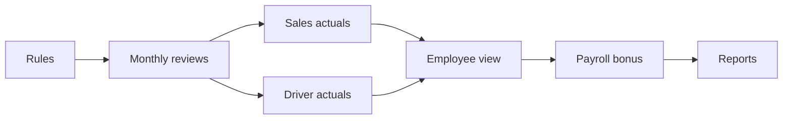

# KPI Implementation Roadmap

This roadmap turns `KPI.xlsx` into a simple monthly KPI workflow for the people who use the application. Sales Representatives and Drivers are delivered first. Additional roles and controls will be added only when daily operations require them.

## Status

| Phase | Status | Result |
|---|---|---|
| Phase 0 — Rules | Complete | [Accepted business rules](./kpi-phase-0-business-rules.md) |
| Phase 1 — Monthly review foundation | Complete | Office KPI Reviews page and API |
| Phase 2 — Sales automatic figures | Complete | Reliable Sales actuals refresh from existing operations |
| Phase 3 — Driver automatic figures | Complete | Driver attendance and delivery results refresh automatically |
| Phase 4 — Employee view and evidence | Complete | Personal score, comparison, history, and source breakdown |
| Phase 5 — Payroll bonus | Complete | Approved bonus posts once as a payroll incentive |
| Phase 6 — Reports | Complete | Monthly and yearly analysis, charts, Excel, and print |

## Phase 0 — Rules

- Review workbook metrics, weights, formulas, and gaps.
- Keep monthly periods and the 40,000 MMK target bonus.
- Use Draft, Submitted, and Approved only.
- Limit the first release to Sales and Driver roles.
- Keep unavailable source metrics as simple manager inputs.

## Phase 1 — Monthly Review Foundation

Delivered:

- Seeded Sales and Driver templates from the workbook.
- Verified 100% weight total for each template.
- Monthly periods and one review per active employee.
- Target and actual entry for measurable metrics.
- 0–100 entry for manager assessed metrics.
- Weighted score and configurable bonus bands.
- Draft, Submit, and Approve actions.
- Office KPI list, filters, summary cards, and one clean review modal.
- Existing Payroll View and Payroll Manage permissions.

The foundation intentionally excludes a formula designer, employee teams, template editing screens, locking, reopening, and separate audit pages.

## Phase 2 — Sales Automatic Figures

Delivered:

- Net eligible invoice value minus confirmed return value, attributed through the original Sales order creator.
- Active customers registered by the Sales Representative after creator attribution was added to the Sales app.
- Completed customer visits from `sales_route_visits`.
- Approved collections assigned to the Sales Representative.
- Distinct accepted attendance days.
- Existing monthly sales target import from `sales_targets` when available.
- Manual target entry when no configured target exists.
- Read-only imported actuals with a short source count and explanation.
- Refresh action for each draft and automatic refresh during monthly review generation.

The Office user reviews the imported figures before submission. Manager score rows remain manual. Historical customers without creator attribution are not guessed or reassigned.

## Phase 3 — Driver Automatic Figures

Delivered:

- Distinct accepted attendance days with an editable working-day target.
- Assigned non-cancelled delivery stops as the completion target.
- Delivered and partially delivered stops as the completion actual.
- Delivered quantity in the completion source explanation.
- Read-only imported actuals and source counts.
- Refresh action for each Driver draft and automatic refresh during monthly generation.

Complaint, damage responsibility, safety, and vehicle cost remain manager scores until their source records are reliable and easy to operate.

## Phase 4 — Employee View and Evidence

Delivered:

- Personal KPI page in both Sales and Driver apps, available from the mobile menu.
- Signed-in employee scoping so a user can see only their own reviews.
- Month selection, current score, review status, and bonus preview.
- Previous-review score comparison and six-month quick history.
- Compact metric cards with target, actual, achievement, weight, and point contribution.
- Short source explanations for figures refreshed from operations.
- Read-only display for Draft, Submitted, and Approved results.

## Phase 5 — Payroll Bonus

Delivered:

- Explicit **Post to payroll** action after an Office user approves a KPI review.
- One active incentive adjustment using the KPI month end as its effective date.
- Employee, KPI month, score, KPI reference, adjustment reference, amount, and posting time in the review workflow.
- Database link, transaction lock, and posting guard to prevent duplicate adjustments.
- Source details in Payroll Adjustments with KPI generated records protected from manual edit or deletion.
- Posted status visible to the employee in the Sales and Driver KPI page.
- Clear instruction to regenerate an existing monthly payroll draft after posting a late bonus.

## Phase 6 — Reports

Delivered:

- Dedicated Office KPI Reports page under Payroll.
- Monthly and yearly filters with optional role and employee selection.
- Role summary with review count, average score, approval count, bonus total, and payroll posting count.
- Monthly and five-year score trend charts for the full team or one employee.
- Bonus total, approval progress, and Draft / Submitted / Approved status breakdown.
- Target versus actual metric analysis with achievement and weighted point contribution.
- Detailed review table with KPI and payroll adjustment references.
- Excel-compatible CSV export and clean print layout.

## Later Scope

Helper and Storekeeper KPI review templates, historical Excel import, and advanced approval controls remain outside the current release. Sales Supervisor team hierarchy and scoped mobile KPI reporting were completed on 2026-10-01.
